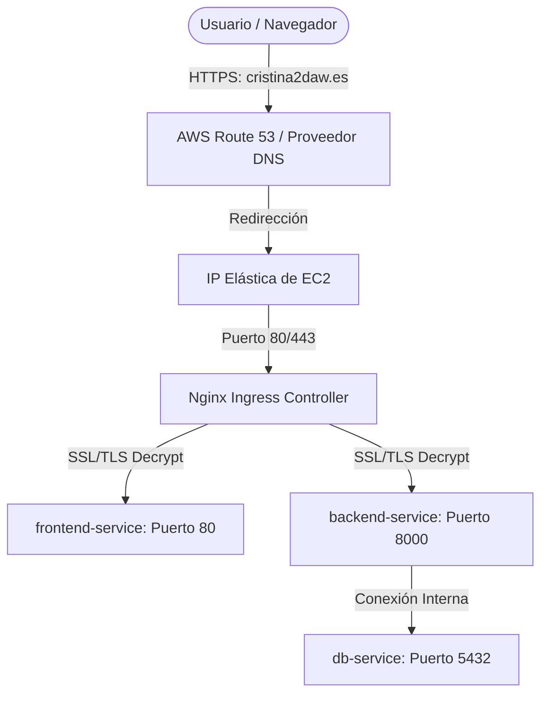

# Guía de Despliegue en AWS con Kubernetes (K3s)

Esta guía documenta paso a paso cómo desplegar la plataforma **Genio Academy** en el entorno cloud de **AWS Academy Learner Lab** utilizando contenedores de producción y **Kubernetes (K3s)**, cumpliendo con los requisitos del módulo de Despliegue.

---

## 🏗️ 1. Concepto y Arquitectura de Despliegue

Para un entorno educativo como AWS Academy (con recursos limitados en su Sandbox), la mejor solución de nivel profesional es utilizar **K3s** (una distribución de Kubernetes ligera desarrollada por Rancher, certificada por la CNCF, altamente eficiente y de consumo mínimo de RAM), corriendo sobre una instancia **EC2** de AWS.

### Estructura de Red y Enrutamiento:


---

## 🚀 2. Paso a Paso del Despliegue

### Paso 2.1: Crear Instancia EC2 en AWS Academy
1.  Inicia sesión en **AWS Academy Learner Lab** y activa el entorno de laboratorio.
2.  Accede a la consola de **Amazon EC2** y pulsa en **Launch Instance**.
3.  **Configuración de la Instancia:**
    *   **Nombre:** `GenioAcademy-K8s`
    *   **SO:** `Ubuntu 22.04 LTS (HVM), SSD Volume Type`
    *   **Tipo de Instancia:** `t3.medium` (Mínimo recomendado para soportar K8s y las réplicas, o `t2.medium` según presupuesto del Lab).
    *   **Key Pair:** Crea un par de claves `.pem` para conectarte mediante SSH.
    *   **Security Group:** Añade reglas para permitir tráfico de red:
        *   `SSH (Puerto 22)` -> Solo desde tu IP.
        *   `HTTP (Puerto 80)` -> Desde cualquier dirección (0.0.0.0/0).
        *   `HTTPS (Puerto 443)` -> Desde cualquier dirección (0.0.0.0/0).
4.  Lanza la instancia. 
5.  *(Recomendado)* Asocia una **IP Elástica (Elastic IP)** a la instancia para que tu IP pública de AWS nunca cambie cuando reinicies el servidor.

---

### Paso 2.2: Conexión SSH e Instalación de K3s
Conéctate a tu máquina en AWS desde tu terminal local:
```bash
ssh -i "tu-clave.pem" ubuntu@tu-ip-elastica-aws
```

Actualiza el sistema e instala **K3s** con un solo comando optimizado:
```bash
sudo apt update && sudo apt upgrade -y

# Instala K3s con el Ingress Controller de Nginx preinstalado
curl -sfL https://get.k3s.io | sh -

# Validamos que Kubernetes esté listo y corriendo
sudo kubectl get nodes
```

---

### Paso 2.3: Configurar el Nombre de Dominio (DNS)
1.  Accede a tu proveedor de dominios (donde compraste `cristina2daw.es`).
2.  Crea tres **Registros A** apuntando a tu IP Elástica de AWS:
    *   `cristina2daw.es` -> `tu-ip-elastica-aws`
    *   `www.cristina2daw.es` -> `tu-ip-elastica-aws`
    *   `api.cristina2daw.es` -> `tu-ip-elastica-aws`

---

### Paso 2.4: Aplicar los Manifiestos de Kubernetes
Sube los manifiestos de la carpeta `kubernetes/` del proyecto a la máquina EC2 (o clona tu repositorio en ella) y aplícalos en orden:

```bash
# 1. Crear el Secret con las credenciales de producción
sudo kubectl apply -f kubernetes/backend-deployment.yaml # Primero creará el Secret y luego el deploy

# 2. Desplegar la Base de Datos PostgreSQL
sudo kubectl apply -f kubernetes/postgres-deployment.yaml

# 3. Desplegar el Backend de Django
sudo kubectl apply -f kubernetes/backend-deployment.yaml

# 4. Desplegar el Frontend de React + Nginx
sudo kubectl apply -f kubernetes/frontend-deployment.yaml

# 5. Desplegar el Enrutador Ingress de Nginx
sudo kubectl apply -f kubernetes/ingress-nginx.yaml
```

Verifica que todos los pods y servicios estén levantados y en estado verde:
```bash
sudo kubectl get pods
sudo kubectl get services
sudo kubectl get ingress
```

---

## 🔒 3. Certificados de Seguridad SSL/TLS (HTTPS)

Para asegurar la comunicación encriptada mediante SSL y satisfacer el requisito de protocolos seguros, se instala **Cert-Manager** en Kubernetes. Éste se encarga de solicitar automáticamente un certificado gratuito a la entidad certificadora **Let's Encrypt**:

```bash
# Instalar Cert-Manager mediante manifiesto oficial
kubectl apply -f https://github.com/cert-manager/cert-manager/releases/download/v1.13.0/cert-manager.yaml

# Esperamos a que cert-manager esté listo
kubectl get pods -n cert-manager
```

### Crear el ClusterIssuer de Let's Encrypt
Crea un archivo llamado `letsencrypt-issuer.yaml` en la máquina EC2:
```yaml
apiVersion: cert-manager.io/v1
kind: ClusterIssuer
metadata:
  name: letsencrypt-prod
spec:
  acme:
    server: https://acme-v02.api.letsencrypt.org/directory
    email: tu-email@cristina2daw.es # Tu email
    privateKeySecretRef:
      name: letsencrypt-prod-key
    solvers:
      - http01:
          ingress:
            class: nginx
```
Y aplícalo:
```bash
sudo kubectl apply -f letsencrypt-issuer.yaml
```

¡Listo! En unos minutos, Cert-Manager validará los registros DNS y generará el certificado de forma totalmente segura. Al entrar en `https://cristina2daw.es`, verás el candado de seguridad en verde.
