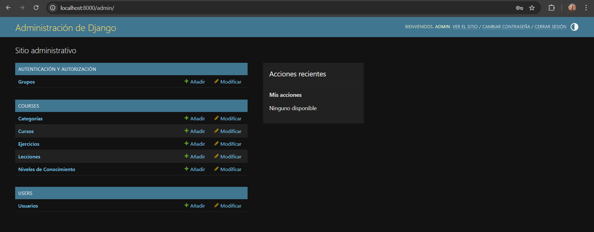
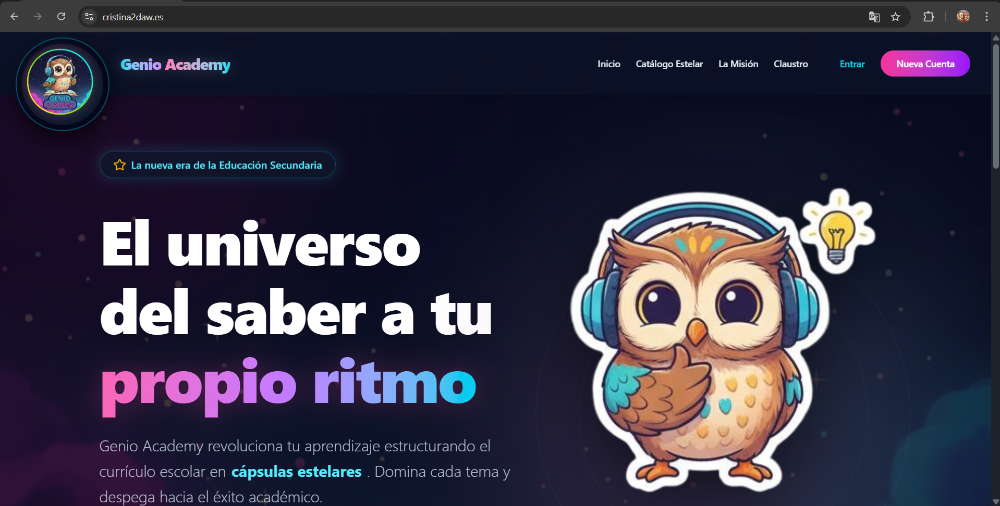
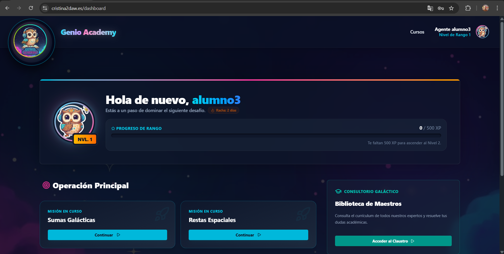
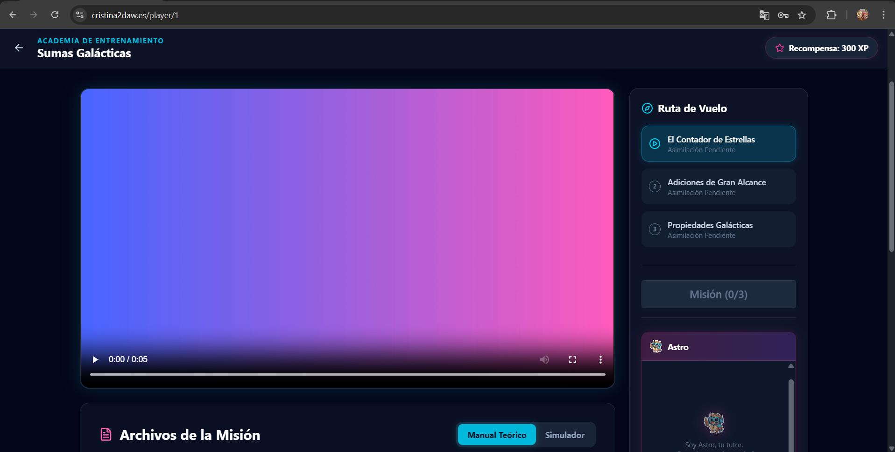
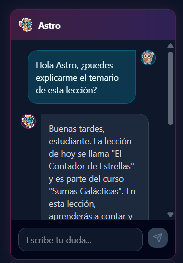
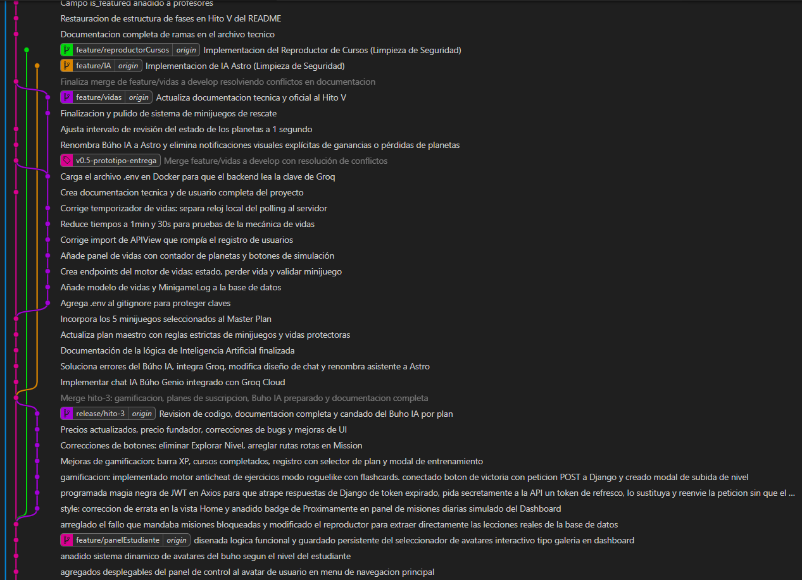

# 📚 DOCUMENTACIÓN TÉCNICA Y DE USUARIO
## Genio Academy — Plataforma de Aprendizaje Incremental para la ESO

> **Autora:** Cristina Moreno Martínez
> **Instituto:** IES Ilíberis
> **Ciclo:** Desarrollo de Aplicaciones Web (DAW)
> **Repositorio GitHub:** https://github.com/Cristina2M/GenioAcademy  
> **Versión del documento:** Hito VII completado + Fase 21 (Despliegue Final) + Expansión de Contenido  
> **Fecha:** Mayo 2026

---

## ÍNDICE

1. [Anteproyecto Actualizado](#1-anteproyecto-actualizado)
2. [Objetivos y Justificación del Proyecto](#2-objetivos-y-justificación-del-proyecto)
3. [Modelo Entidad-Relación](#3-modelo-entidad-relación)
4. [Modelo de Clases y Casos de Uso](#4-modelo-de-clases-y-casos-de-uso)
5. [Tecnologías Empleadas](#5-tecnologías-empleadas)
6. [Estructura de Ficheros del Proyecto](#6-estructura-de-ficheros-del-proyecto)
7. [Manual de Usuario](#7-manual-de-usuario)
8. [Manual del Desarrollador](#8-manual-del-desarrollador)
9. [Plan de Negocio](#9-plan-de-negocio)
10. [Diapositivas para la Exposición (Guión)](#10-diapositivas-para-la-exposición-guión)
11. [Enlace al Código en GitHub](#11-enlace-al-código-en-github)
12. [Entornos de Ejecución y Producción](#12-entornos-de-ejecución-y-producción)
13. [Dificultades Encontradas](#13-dificultades-encontradas)

---

<div style="page-break-after: always;"></div>

## 1. Anteproyecto Actualizado

### Descripción General

**Genio Academy** es una plataforma web de academia online que he desarrollado como Proyecto de Fin de Ciclo del Grado Superior de Desarrollo de Aplicaciones Web. La idea surgió porque llevo tiempo pensando que las plataformas de estudio online que existen (tipo Udemy o Khan Academy) no están del todo adaptadas a las necesidades reales de los estudiantes de secundaria en España. El principal problema es que o son demasiado generalistas, o están en inglés, o no tienen en cuenta que cada alumno aprende a un ritmo distinto.

El concepto central de Genio Academy es que el contenido está organizado por **niveles de conocimiento progresivos** dentro de cada asignatura, en lugar de seguir el esquema típico de cursos cerrados por edad. Esto significa que un alumno que domina bien las matemáticas puede avanzar más rápido en esa materia, aunque en lengua vaya al ritmo normal. Se trata, básicamente, de un aprendizaje adaptativo.

Para que la plataforma resultara más atractiva y los alumnos quisieran usarla de verdad (no solo porque se lo manden en clase), decidí incorporar mecánicas propias de los videojuegos. Si analizo lo que motiva a los usuarios a utilizar aplicaciones como Duolingo o cualquier juego RPG, es esa sensación de estar progresando, de subir de nivel y desbloquear logros. He querido replicar esa experiencia pero aplicada al estudio real.

La plataforma se apoya en **cuatro pilares** principales:

- **Gamificación tipo RPG:** Los alumnos acumulan puntos de experiencia (XP) completando cursos. Cuando reúnen suficiente XP suben de nivel, y cada nuevo nivel desbloquea más contenido y nuevos avatares de búho para personalizar su perfil.

- **Tutor IA (Astro):** Hay un asistente de inteligencia artificial integrado en el reproductor de cursos llamado Astro. Lo interesante es que no da las respuestas directamente, sino que utiliza el **método socrático**: hace preguntas para que el propio alumno llegue a la solución. Lo he implementado conectando el backend con la API de Groq y el modelo `llama-3.1-8b-instant`. Astro además sabe en qué lección estás en cada momento, por lo que sus respuestas siempre tienen contexto.

- **Mecánica Roguelike de Vidas:** Los alumnos disponen de 3 "planetas" (vidas). Si fallan una evaluación, pierden un planeta. Esto es importante porque otorga consecuencias reales a las pruebas, evitando que se puedan repetir sin límite hasta acertar por casualidad. Los planetas se recuperan solos con el tiempo, o, si se tiene el plan superior, superando minijuegos educativos.

- **Claustro Interactivo:** Es el catálogo de profesores especializados. Los usuarios del plan premium pueden solicitar tutorías directas y conectarse mediante videollamada integrada (sin salir de la plataforma).

Técnicamente, el proyecto está estructurado como una arquitectura de **microservicios** usando Docker: el frontend es una SPA en React + Vite, el backend es una API REST en Django, y la base de datos es PostgreSQL. Actualmente está desplegado en producción utilizando servicios en la nube como Vercel y Render.

<div style="page-break-after: always;"></div>

### Estado de desarrollo por Hitos

El proyecto se planificó en distintas etapas o hitos. Aquí un resumen del estado de cada uno:

| Hito | Descripción | Estado |
|------|-------------|--------|
| I | Fundamentos e Infraestructura DevOps (Docker, estructura inicial) | ✅ Completado |
| II | Backend y Base de Datos (Django, PostgreSQL, API REST) | ✅ Completado |
| III | Frontend y Experiencia de Usuario (React, diseño, páginas) | ✅ Completado |
| IV | Integración de Inteligencia Artificial (tutor Astro con Groq) | ✅ Completado |
| V | Sistema de Vidas y Minijuegos Roguelike | ✅ Completado |
| VI | Catálogo de Profesores y Videoconferencias Jitsi | ✅ Completado |
| VII | Correcciones generales, contenido educativo y documentación | ✅ Completado |
| **+** | **Despliegue en producción y estabilización final** | ✅ Completado |


### Cambios y Justificación respecto al Anteproyecto Inicial

A lo largo del desarrollo del proyecto, la realidad técnica me obligó a tomar decisiones y pivotar respecto a la idea original del anteproyecto. Estos cambios no son errores de planificación, sino decisiones de arquitectura justificadas:

1. **De Kubernetes/Docker Swarm a PaaS (Vercel y Render):** En el anteproyecto contemplé usar Kubernetes para orquestar contenedores en la nube. Sin embargo, al llegar a la fase de despliegue, evalué los costes (mantener un clúster de K8s 24/7 es muy caro para un proyecto de estudiante) y la complejidad innecesaria para el tráfico esperado inicial. Decidí pivotar hacia un despliegue **PaaS (Platform as a Service)** utilizando Vercel para el Frontend y Render para el Backend. Sigo usando Docker en local para garantizar la portabilidad, pero el despliegue es mucho más ágil y gratuito.
2. **De Ollama Local a Groq Cloud (Tutor IA):** Inicialmente iba a usar la API de Ollama para correr el modelo localmente. En la práctica, el hardware necesario para correr un modelo en local (even uno pequeño) provocaba latencias inaceptables en las respuestas del tutor Astro. Para solucionarlo, migré la integración hacia **Groq**, un proveedor en la nube que ofrece inferencia ultrarrápida (LPU).
3. **Descarte de LDAP y S3 Buckets:** Se valoró LDAP para la gestión de usuarios, pero para el alcance de Genio Academy (enfocado a usuarios finales y no a redes corporativas internas), el sistema de JWT enriquecido resultó mucho más seguro, rápido y estándar. Respecto a S3 para multimedia, actualmente los recursos (como los avatares) se cargan desde el propio bundle de React o bases de datos ligeras para mantener los costes a cero, aunque la base de código está preparada para integrarlo si el proyecto escala.
4. **Sistema de Vidas y RPG más profundo:** En el diseño inicial solo se mencionaba una "API externa de avatares". Decidí ir un paso más allá en la gamificación y desarrollé todo un motor propio de subida de experiencia, niveles (Bloqueos 403 reales en servidor) y el sistema *Roguelike* de regeneración de vidas por tiempo, lo que aporta muchísimo más valor diferencial que solo usar avatares de DiceBear.

<div style="page-break-after: always;"></div>

5. **Funciones pospuestas al Backlog (PDFs, Email y n8n):** Ciertas funcionalidades clásicas como la generación de diplomas en PDF, la validación de cuentas por correo electrónico o las integraciones externas de automatización (ej. n8n), estaban inicialmente contempladas. Sin embargo, aplicando principios ágiles (Agile), decidí desplazarlas a la versión 2.0. El motivo es que preferí invertir el presupuesto de horas de desarrollo en asegurar que el *core* innovador de la app (el motor adaptativo, la IA en tiempo real y las videollamadas) fuera robusto y libre de fallos para este Producto Mínimo Viable (MVP).
6. **Internacionalización (i18n) y Branding:** Para cumplir con los criterios de evaluación y mejorar la profesionalidad del producto, se ha implementado un sistema completo de internacionalización bilingüe (Español/Inglés) con un *LanguageContext*. Este sistema traduce dinámicamente las páginas públicas más complejas (Inicio, Misión, Claustro) y muestra el selector de idioma de forma condicional solo en estas vistas. Además, se ha pulido el branding final en producción, reemplazando los meta-tags genéricos de Vite por el logotipo oficial y título de Genio Academy en la pestaña del navegador.

---

<div style="page-break-after: always;"></div>


## 2. Objetivos y Justificación del Proyecto

### Problemática Detectada

Antes de empezar a programar, dediqué un tiempo a analizar el problema que quería resolver. Si no tienes claro el "para qué", es fácil terminar desarrollando algo que técnicamente funcione pero que nadie necesite.

El problema principal que observé es que **los alumnos de la ESO carecen de una herramienta digital de estudio que esté pensada genuinamente para ellos**. Lo que hay actualmente en el mercado presenta varias carencias:

1. **Falta de motivación real:** Plataformas como Moodle son funcionales pero visual y mecánicamente aburridas. No hay nada que incentive a seguir estudiando más allá de la mera obligación impuesta por el profesor.
2. **Ritmo único para todos:** En un aula convencional todos avanzan al mismo ritmo. Si tienes dificultades en un área, el grupo sigue adelante; si sobresales, te estancas esperando al resto.
3. **Falta de refuerzo inmediato:** Cuando un estudiante tiene una duda estudiando por la tarde en casa, no siempre hay alguien que le pueda ayudar al momento.
4. **Ausencia de consecuencias pedagógicas:** En muchas plataformas puedes hacer el mismo test infinidad de veces hasta acertar todas las opciones por ensayo y error. Esto hace que el proceso de evaluación no se tome en serio.

### Solución Propuesta

Genio Academy pretende dar respuesta a estas carencias mediante:

**Aprendizaje incremental personalizado:** El contenido se organiza por niveles de dificultad en cada materia. No puedes acceder al siguiente nivel hasta que demuestres que dominas el actual. Esto no es solo una restricción visual: lo gestiona el backend mediante comprobaciones, de forma que intentar acceder a un curso superior al nivel RPG actual devuelve un error `403 Forbidden`.

**Gamificación con consecuencias reales:** He procurado que los elementos de juego no sean solo adornos cosméticos. Todo tiene una función:
- Los **puntos de experiencia (XP)** acumulados te permiten subir de nivel. La fórmula que utilizo es: `XP necesarios = nivel_actual × 500`. Así, los primeros niveles son rápidos de superar para "enganchar" al estudiante, y luego el reto va creciendo.
- Las **vidas (planetas)** aseguran que evaluar conocimientos tenga consecuencias.
- El **avatar** representa visualmente el progreso, ya que los búhos más elaborados requieren haber alcanzado niveles altos.

**Tutor inteligente accesible:** Astro está disponible 24/7 para ayudar con el temario. Su configuración prohíbe que dé respuestas directas; en su lugar, guía al alumno con pistas y preguntas, fomentando que sea él quien construya la respuesta.

**Conectividad con profesores reales:** Para el apoyo que la IA no puede cubrir, el sistema incluye la opción de contactar con especialistas para tutorías por videollamada en vivo.

<div style="page-break-after: always;"></div>

### Objetivos Específicos

Los objetivos concretos que me marqué al inicio del proyecto fueron:

- Desarrollar una plataforma web funcional y responsiva utilizando tecnologías modernas (React, Django, PostgreSQL, Docker).
- Implementar un sistema de autenticación seguro con tokens JWT, que a la vez integren la información de gamificación del alumno para evitar consultas innecesarias a la base de datos.
- Crear una lógica educativa robusta que controle el acceso al contenido según el nivel, con validación tanto en cliente como en servidor.
- Integrar un asistente de inteligencia artificial de forma segura, canalizando todas las peticiones a través del backend para no exponer la clave de la API.
- Diseñar un sistema de vidas (planetas) con penalizaciones y regeneración pasiva y activa (minijuegos).
- Diferenciar funcionalidades mediante tres planes de suscripción gestionados desde el servidor.
- Construir un catálogo de profesores con un flujo completo de solicitud y videollamada.
- Desplegar el proyecto en producción con dominio propio y certificados de seguridad SSL.

---

<div style="page-break-after: always;"></div>

## 3. Modelo Entidad-Relación

Esta sección explica cómo está organizada la base de datos del proyecto. El Modelo Entidad-Relación (E-R) es básicamente un diagrama que muestra qué tablas existen, qué información guarda cada una y cómo se relacionan entre sí.

Para diseñarlo usé el panel de administración de Django junto con el ORM (Object-Relational Mapper), que es la herramienta que tiene Django para definir los modelos de datos en Python y que él mismo se encarga de traducirlos a tablas SQL en PostgreSQL.




### ¿Qué es una clave primaria (PK) y una clave foránea (FK)?

Antes de ver el diagrama, una aclaración rápida para quien no esté familiarizado:

- **PK (Primary Key):** Es el identificador único de cada fila de una tabla. No pueden repetirse dos registros con el mismo PK. En Django, si no especificas uno, se crea automáticamente un campo `id` autoincremental.
- **FK (Foreign Key):** Es una referencia al PK de otra tabla. Por ejemplo, si una `Lesson` tiene un campo `course (FK)`, significa que esa lección pertenece al curso cuyo `id` coincide con ese valor. Es la forma de "conectar" tablas entre sí.
- **M2M (Many to Many):** Relación de muchos a muchos. Por ejemplo, un profesor puede impartir varias materias, y una materia puede tener varios profesores. Django gestiona esto con una tabla intermedia automática.

<div style="page-break-after: always;"></div>

### Entidades Principales

```
┌─────────────────────────────────────────────────────────────────────┐
│                    MODELO E-R COMPLETO                               │
└─────────────────────────────────────────────────────────────────────┘

  ┌──────────────────────┐        ┌──────────────────┐
  │      CustomUser      │        │     Category     │
  ├──────────────────────┤        ├──────────────────┤
  │ id (PK)              │        │ id (PK)          │
  │ username             │        │ name             │
  │ email                │        │ description      │
  │ password (hashed)    │        └────────┬─────────┘
  │ subscription_level   │                 │ 1:N
  │ experience_points    │        ┌────────▼─────────┐
  │ current_student_level│        │  KnowledgeLevel  │
  │ selected_avatar      │        ├──────────────────┤
  │ lives_count          │        │ id (PK)          │
  │ last_life_lost_at    │        │ category (FK)    │
  │ is_teacher*          │        │ name             │
  └──────┬───────────────┘        │ order            │
         │                        └────────┬─────────┘
         │ (vía CourseCompletion)          │ 1:N
         │ N:M con Course         ┌────────▼─────────┐
         │                        │      Course      │
  ┌──────▼───────────────┐        ├──────────────────┤
  │  CourseCompletion    │        │ id (PK)          │
  ├──────────────────────┤        │ knowledge_level  │
  │ id (PK)              │◄───────│   (FK)           │
  │ user (FK)            │        │ title            │
  │ course (FK)          │        │ description      │
  │ completed_at         │        │ xp_reward        │
  │ UNIQUE(user, course) │        └────────┬─────────┘
  └──────────────────────┘                 │ 1:N
                                  ┌────────▼─────────┐
  ┌───────────────────────┐       │      Lesson      │
  │     MinigameLog       │       ├──────────────────┤
  ├───────────────────────┤       │ id (PK)          │
  │ id (PK)               │       │ course (FK)      │
  │ user (FK)             │       │ title            │
  │ minigame_id           │       │ content (HTML)   │
  │ played_at             │       │ order            │
  └───────────────────────┘       └────────┬─────────┘
                                           │ 1:N
  ┌───────────────────────┐       ┌────────▼─────────┐
  │      Professor        │       │     Exercise     │
  ├───────────────────────┤       ├──────────────────┤
  │ id (PK)               │       │ id (PK)          │
  │ user (FK, OneToOne)   │       │ lesson (FK)      │
  │ full_name             │       │ question         │
  │ title                 │       │ options (JSON)   │
  │ bio                   │       │ correct_answer   │
  │ avatar_url            │       └──────────────────┘
  │ is_active             │
  │ is_featured           │
  │ cv_json (JSON)        │
  │ subjects (M2M →       │
  │   Category)           │
  └──────┬────────────────┘
         │ 1:N
  ┌──────▼────────────────┐
  │     Consultation      │
  ├───────────────────────┤
  │ id (PK)               │
  │ student (FK)          │
  │ professor (FK)        │
  │ course (FK, nullable) │
  │ message               │
  │ response              │
  │ status                │
  │ meeting_link          │
  │ is_live_call          │
  │ created_at            │
  │ updated_at            │
  └───────────────────────┘

  * is_teacher NO es un campo de base de datos sino un campo calculado:
    devuelve True si el usuario tiene un professor_profile asociado
    (relación OneToOne con Professor). Así no duplicamos información.
```

### Descripción de cada entidad

**CustomUser** — extiende el modelo `AbstractUser` de Django. En lugar de crear una tabla de usuarios desde cero, Django ya te da una base con username, email y password, y tú la puedes ampliar. En mi caso añadí los campos de gamificación:
- `subscription_level`: entero (1, 2 o 3) que indica el plan del alumno. Usando `IntegerChoices` de Django para que solo acepte esos tres valores.
- `experience_points`: los XP acumulados del alumno.
- `current_student_level`: el nivel RPG actual. Empieza en 1.
- `selected_avatar`: string con el nombre del búho elegido (ej: `"buho3"`).
- `lives_count`: cuántos planetas le quedan (0 a 3).
- `last_life_lost_at`: timestamp de cuándo perdió el último planeta. Sirve para calcular la regeneración pasiva.

**Category** — representa una asignatura (Matemáticas, Historia, Física...). Es la raíz del árbol de contenido.

**KnowledgeLevel** — cada asignatura tiene varios niveles de dificultad. El campo `order` indica qué nivel RPG mínimo necesita el alumno para acceder a los cursos de este nivel. Por ejemplo, `order=2` significa que necesitas nivel RPG 2 o superior.

**Course** — un curso concreto dentro de un nivel de conocimiento. Tiene un campo `xp_reward` que indica cuántos XP gana el alumno al completarlo.

**Lesson** — cada curso tiene varias lecciones. El campo `content` almacena el texto de la teoría en formato HTML, lo que permite formatear el contenido con negritas, colores, listas, etc. El frontend lo renderiza con `dangerouslySetInnerHTML`.

**Exercise** — las preguntas tipo test de cada lección. El campo `options` es un `JSONField` que almacena una lista de strings con las posibles respuestas. El campo `correct_answer` debe coincidir exactamente con una de esas opciones.

**CourseCompletion** — registra qué alumnos han completado qué cursos. La restricción `UNIQUE(user, course)` es importante: impide que un alumno complete el mismo curso dos veces y se lleve los XP de nuevo ("farmeo de XP").

**UserCourseProgress** — similar a CourseCompletion pero para registrar los cursos que están en progreso (iniciados pero no completados todavía). Sirve para mostrar la sección "en progreso" en el historial del alumno.

**MinigameLog** — guarda un registro de cuándo jugó cada alumno a cada minijuego. Sirve para implementar el cooldown: si `played_at` es reciente, el minijuego no está disponible todavía.

**Professor** — el perfil del docente. Tiene relación OneToOne con `CustomUser`, lo que significa que cada profesor es también un usuario Django y puede iniciar sesión. El campo `cv_json` guarda el currículum del profesor en formato JSON.

**Consultation** — una solicitud de tutoría. Conecta un alumno (`student`) con un profesor (`professor`), y opcionalmente con un curso concreto. El campo `status` puede ser `PENDING` (esperando respuesta), `IN_CALL` (videollamada en curso) o `ANSWERED` (resuelta).

### Relaciones entre tablas

| Relación | Tipo | Descripción |
|----------|------|-------------|
| `CustomUser` → `CourseCompletion` | 1:N | Un alumno puede completar muchos cursos |
| `CustomUser` → `UserCourseProgress` | 1:N | Un alumno puede tener muchos cursos en progreso |
| `Course` → `UserCourseProgress` | 1:N | Un curso puede ser iniciado por muchos alumnos |
| `Course` → `CourseCompletion` | 1:N | Un curso puede ser completado por muchos alumnos |
| `CustomUser` → `MinigameLog` | 1:N | Un alumno puede tener muchos registros de minijuego |
| `Category` → `KnowledgeLevel` | 1:N | Una asignatura tiene varios niveles de dificultad |
| `KnowledgeLevel` → `Course` | 1:N | Un nivel contiene varios cursos |
| `Course` → `Lesson` | 1:N | Un curso tiene varias lecciones |
| `Lesson` → `Exercise` | 1:N | Una lección tiene varios ejercicios tipo test |
| `Professor` → `Category` | N:M | Un profesor puede impartir varias materias |
| `Professor` → `Consultation` | 1:N | Un profesor puede recibir muchas consultas |
| `CustomUser` → `Professor` | 1:1 | Un profesor tiene un usuario Django para hacer login |

### Restricciones de Integridad

Estas son las reglas que garantizan que los datos de la base de datos sean siempre consistentes:

- La combinación `(user, course)` en `CourseCompletion` es **UNIQUE** — impide el farmeo de XP completando el mismo curso varias veces.
- `lives_count` nunca puede superar `MAX_LIVES = 3`. Esto no está forzado a nivel de base de datos (con un constraint SQL), sino en la lógica Python del backend. Cuando se intenta sumar una vida, se comprueba primero que `lives_count < 3`.
- `subscription_level` solo acepta los valores 1, 2 o 3. Se define con `IntegerChoices` de Django, que hace que el ORM rechace cualquier otro valor.
- El campo `options` de `Exercise` es un `JSONField` y debe ser una lista de strings. Ejemplo válido: `["3", "6", "9", "12"]`.
- El campo `correct_answer` de `Exercise` debe coincidir exactamente (mismo texto, respetando mayúsculas) con uno de los valores de `options`. Esta validación se hace a nivel de lógica en el componente React `LessonQuiz.jsx`.
- Los valores válidos para `status` en `Consultation` son: `'PENDING'`, `'IN_CALL'` y `'ANSWERED'`. Cualquier otro valor sería rechazado por el serializer de Django REST Framework.

---

<div style="page-break-after: always;"></div>

## 4. Modelo de Clases y Casos de Uso

### Arquitectura de Capas (Backend)

El backend sigue una arquitectura de tres capas bastante típica en aplicaciones web. Lo aprendí en las prácticas de la empresa y quise intentar aplicarlo de la forma más limpia posible:

```
┌──────────────────────────────────────────────────────────────┐
│                    CAPA DE PRESENTACIÓN                       │
│              (Django REST Framework API)                       │
│                                                               │
│  users/views.py          courses/views.py      ai/views.py   │
│  ├── MyTokenObtainPair   ├── CategoryViewSet   ├── ChatView  │
│  ├── RegisterView        ├── KnowledgeLevelVS  └──────────   │
│  ├── UserViewSet         ├── CourseViewSet                   │
│  │   └── update_avatar   └── LessonViewSet                   │
│  ├── LivesView           teachers/views.py                   │
│  ├── DecreaseLivesView   ├── ProfessorViewSet                │
│  └── MinigamePlayView    └── ConsultationViewSet             │
│                              ├── my_students                 │
│                              ├── start_call                  │
│                              ├── end_call                    │
│                              └── active_calls                │
└───────────────────────┬──────────────────────────────────────┘
                        │
┌───────────────────────▼──────────────────────────────────────┐
│                    CAPA DE LÓGICA                              │
│                                                               │
│  sync_lives(user)        → Motor de regeneración pasiva      │
│  get_lives_data(user)    → Helper: estado completo de vidas  │
│  check_unlocked(user, n) → Bloqueo 403 por nivel RPG         │
│  MyTokenObtainPairSerializer → JWT enriquecido con RPG data  │
│  UserSerializer          → Transforma User ↔ JSON            │
│  SYSTEM_PROMPT           → Instrucciones de Astro (IA)       │
└───────────────────────┬──────────────────────────────────────┘
                        │
┌───────────────────────▼──────────────────────────────────────┐
│                    CAPA DE DATOS                               │
│              (PostgreSQL + Django ORM)                         │
│                                                               │
│  CustomUser    KnowledgeLevel  Course      Lesson            │
│  Category      Exercise        CourseCompletion              │
│  MinigameLog   Professor       Consultation                  │
└──────────────────────────────────────────────────────────────┘
```
<div style="page-break-after: always;"></div>

**¿Qué hace cada capa?**

- **Capa de Presentación:** Son los `views.py` de cada app Django. Reciben las peticiones HTTP del frontend, llaman a la lógica que corresponda y devuelven una respuesta JSON. Con Django REST Framework se definen como `ViewSet` o como `APIView`. Los `ViewSet` son más prácticos porque generan automáticamente los endpoints típicos de un CRUD (GET, POST, PUT, DELETE) con muy poco código.

- **Capa de Lógica:** Son funciones auxiliares (helpers) y serializadores que contienen las reglas de negocio. Por ejemplo, `sync_lives(user)` es una función que calcula cuántas vidas ha regenerado el alumno desde la última vez que se consultaron, sin necesidad de procesos en segundo plano. Los serializadores son clases que convierten los objetos de Django (instancias de modelo) a JSON y viceversa.

- **Capa de Datos:** Los modelos de Django y la base de datos PostgreSQL. Los modelos son clases Python que definen la estructura de las tablas. El ORM de Django se encarga de ejecutar las consultas SQL necesarias de forma transparente.

### Arquitectura del Frontend (React SPA)

El frontend es una SPA (Single Page Application), lo que significa que es una sola página HTML que React va actualizando dinámicamente según navegas, sin recargar el navegador. Esto da una experiencia mucho más fluida.

```
src/
 ├── App.jsx              → Router principal. Define todas las rutas de la app.
 ├── context/
 │   └── AuthContext.jsx  → Estado global: sesión, user, login(), logout()
 ├── utils/
 │   ├── PrivateRoute.jsx → Guard: redirige a /login si no hay token
 │   ├── axiosInstance.js → Cliente HTTP con interceptor JWT automático
 │   └── avatarUtils.js   → Mapa de búhos y lógica de desbloqueo
 ├── pages/
 │   ├── Home.jsx             → Landing page pública (estética espacial)
 │   ├── Courses.jsx          → Catálogo Estelar: asignaturas y niveles
 │   ├── Mission.jsx          → Página de planes y precios
 │   ├── Login.jsx            → Formulario de inicio de sesión
 │   ├── Register.jsx         → Formulario de registro con selección de plan
 │   ├── Dashboard.jsx        → Panel de control del alumno con gamificación
 │   ├── CoursePlayer.jsx     → Reproductor: teoría + quiz + sidebar
 │   ├── Claustro.jsx         → Catálogo público de profesores
 │   ├── StudentCatalog.jsx   → Claustro privado para alumnos (Plan 3)
 │   ├── MySpaceJourney.jsx   → Historial de cursos (en progreso y completados)
 │   └── TeacherDashboard.jsx → Panel docente: consultas y alumnos
 └── components/
     ├── Navbar.jsx               → Barra de navegación global
     ├── ActiveCallBanner.jsx     → Banner global de videollamada activa
     ├── AIChatPanel.jsx          → Chat con Astro (IA) integrado en CoursePlayer
     ├── LivesPanel.jsx           → Panel de planetas y acceso a minijuegos
     ├── LessonQuiz.jsx           → Componente de preguntas tipo test
     ├── TutoringModal.jsx        → Modal de solicitud de tutoría
     ├── JitsiMeetWrapper.jsx     → IFRAME de videollamada Jitsi embebido
     ├── ProfessorCard.jsx        → Tarjeta de profesor con CV modal
     ├── StudentCardModal.jsx     → Modal de ficha de alumno (para profesores)
     ├── ScrollToTop.jsx          → Efecto scroll al inicio al cambiar de ruta
     ├── ScrollToTopButton.jsx    → Botón flotante de "volver arriba"
     ├── MinijuegoParejas.jsx     → Minijuego: encontrar parejas de búhos
     ├── MinijuegoCalculo.jsx     → Minijuego: cálculo mental rápido
     ├── MinijuegoSopaLetras.jsx  → Minijuego: sopa de letras temática
     ├── MinijuegoCompletar.jsx   → Minijuego: completar la palabra
     └── MinijuegoVerdaderoFalso.jsx → Minijuego: verdadero o falso
```

**Piezas clave del frontend que merece la pena explicar:**

- **`AuthContext.jsx`:** Es el "cerebro" de la sesión en el cliente. Usa la Context API de React para que cualquier componente de la app pueda saber si hay un usuario conectado, quién es, su nivel, sus XP, etc. sin tener que pasarlo por props de componente en componente. Cuando el alumno hace login, el token JWT se guarda en `localStorage` y se decodifica para extraer los datos del payload (nivel, XP, avatar, plan...).

- **`axiosInstance.js`:** Es un cliente HTTP configurado con un interceptor. Lo que hace el interceptor es añadir automáticamente el header `Authorization: Bearer <token>` a todas las peticiones que se hacen al backend. Así no tengo que acordarme de incluirlo manualmente en cada llamada. También tiene lógica de refresco: si el token de acceso ha caducado, intenta renovarlo con el token de refresco antes de devolver un error.

- **`PrivateRoute.jsx`:** Un componente que envuelve las rutas privadas. Si el usuario no está autenticado, le redirige al login. Si sí lo está, deja pasar al componente de la ruta.

<div style="page-break-after: always;"></div>

### Rutas de la Aplicación (App.jsx)

| URL | Componente | Tipo de acceso |
|-----|------------|----------------|
| `/` | `Home` | Público (landing page) |
| `/courses` | `Courses` | Público (catálogo sin datos de progreso) |
| `/mission` | `Mission` | Público (precios y planes) |
| `/claustro` | `Claustro` | Público (solo profesores destacados) |
| `/login` | `Login` | Público |
| `/register` | `Register` | Público |
| `/dashboard` | `Dashboard` | 🔒 Privado (requiere login) |
| `/dashboard/claustro` | `StudentCatalog` | 🔒 Privado (requiere login) |
| `/mi-trayectoria` | `MySpaceJourney` | 🔒 Privado (requiere login) |
| `/player/:courseId` | `CoursePlayer` | 🔒 Privado (requiere login) |
| `/teacher-dashboard` | `TeacherDashboard` | 🔒 Privado (requiere `is_teacher`) |
| `*` | Mensaje 404 inline | Público |

### Casos de Uso Principales

Los casos de uso describen cómo interactúan los usuarios con el sistema paso a paso. Los he documentado para los flujos más importantes de la plataforma.

#### CU-01: Registro de un alumno nuevo

- **Actor:** Visitante (sin cuenta)
- **Precondición:** El usuario accede a `/register`
- **Descripción paso a paso:**
  1. El usuario selecciona un plan de suscripción (1, 2 o 3) en el formulario de registro.
  2. Rellena su nombre de usuario, email y contraseña.
  3. Pulsa "Finalizar Misión de Registro".
  4. El frontend hace `POST /api/users/register/` con esos datos.
  5. El backend crea el usuario con `lives_count=3`, `experience_points=0`, `current_student_level=1` y avatar `buho1`.
- **Endpoint:** `POST /api/users/register/`
- **Resultado:** Alumno registrado. El frontend redirige al login.
- **Posibles errores:** Username o email ya en uso (400), contraseña demasiado corta (400).

<div style="page-break-after: always;"></div>

#### CU-02: Login y obtención de sesión JWT

- **Actor:** Alumno registrado
- **Precondición:** El usuario tiene una cuenta creada
- **Descripción paso a paso:**
  1. El alumno introduce su username (o email) y contraseña en `/login`.
  2. El frontend hace `POST /api/token/` con las credenciales.
  3. El backend usa el `EmailOrUsernameBackend` personalizado para validar (acepta tanto email como username).
  4. Si son correctas, emite un par de tokens JWT: `access` (expira en 15min) y `refresh` (expira en 7 días).
  5. El token de acceso lleva embebidos en su payload: `username`, `current_student_level`, `experience_points`, `selected_avatar`, `subscription_level` e `is_teacher`.
  6. El `AuthContext` guarda ambos tokens en `localStorage` y actualiza el estado global.
- **Endpoint:** `POST /api/token/`
- **Resultado:** Alumno conectado, redirigido al Dashboard.

**¿Qué es un JWT?** JWT son las siglas de JSON Web Token. Es un estándar para transmitir información de forma segura entre dos partes (en este caso, el frontend y el backend) usando una firma digital. El token tiene tres partes separadas por puntos: header (tipo de algoritmo), payload (los datos) y signature (la firma que garantiza que no ha sido manipulado). El backend firma el token con una clave secreta (`SECRET_KEY`) que solo él conoce, así que si alguien intenta falsificar un token, la firma no coincidirá y el servidor lo rechazará.

#### CU-03: Explorar el catálogo de cursos

- **Actor:** Alumno conectado (cualquier plan)
- **Descripción:** El alumno navega a `/courses`. El frontend hace `GET /api/courses/categories/` con su token JWT. El backend devuelve el árbol completo de asignaturas → niveles → cursos. Para cada curso, incluye si el alumno lo ha iniciado (`is_started`) o completado (`is_completed`). Los niveles cuyo campo `order` supera el `current_student_level` del alumno aparecen con candado en el frontend.
- **Endpoint:** `GET /api/courses/categories/`
- **Resultado:** El alumno ve el catálogo con los cursos disponibles y bloqueados claramente diferenciados.
- **Nota:** Si el alumno intenta acceder directamente a un curso bloqueado via URL (ej: `/player/5`), el backend devolverá `403 Forbidden` al intentar cargar los datos del curso.

<div style="page-break-after: always;"></div>

#### CU-04: Completar un curso y ganar XP

- **Actor:** Alumno conectado (cualquier plan)
- **Descripción paso a paso:**
  1. El alumno entra al reproductor de un curso (`/player/:courseId`).
  2. Lee la teoría de cada lección y completa el quiz de cada una en la pestaña "Simulador".
  3. Cuando ha superado el quiz de todas las lecciones, el botón "Completar Misión" se activa.
  4. Al pulsarlo, el frontend hace `POST /api/courses/courses/{id}/complete/`.
  5. El backend comprueba que el alumno no haya completado ya ese curso (unicidad de `CourseCompletion`).
  6. Si es la primera vez, suma los `xp_reward` del curso a `experience_points` del alumno.
  7. Comprueba si el alumno sube de nivel: si `experience_points >= current_student_level * 500`, incrementa `current_student_level`.
  8. Genera un nuevo JWT con los datos actualizados y lo devuelve al frontend.
  9. El `AuthContext` actualiza el token y el estado global (nivel y XP visibles en la navbar al instante).
- **Endpoint:** `POST /api/courses/courses/{id}/complete/`
- **Resultado:** XP sumados, posible subida de nivel, modal de victoria con animación.

#### CU-05: Consultar al tutor Astro (IA)

- **Actor:** Alumno con Plan 2 o Plan 3
- **Descripción:** Dentro del reproductor de curso, el alumno escribe su duda en el panel de Astro y pulsa enviar. El frontend manda `POST /api/ai/chat/` con el texto del mensaje, el nombre del curso y el título de la lección activa. El backend construye un `SYSTEM_PROMPT` que incluye las instrucciones de comportamiento socrático de Astro, el contexto de la lección y la hora actual (para saludos contextuales). Envía todo esto a la API de Groq y reenvía la respuesta al alumno.
- **Endpoint:** `POST /api/ai/chat/`
- **Resultado:** Respuesta de Astro que guía sin revelar la solución directa.
- **Restricción:** Si el alumno tiene Plan 1, el backend devuelve `403 Forbidden`. El frontend muestra un aviso para actualizar el plan.

<div style="page-break-after: always;"></div>

#### CU-06: Fallar una evaluación y perder un planeta

- **Actor:** Alumno conectado (cualquier plan)
- **Descripción:** Cuando el alumno responde incorrectamente una pregunta en `LessonQuiz.jsx`, el componente llama automáticamente a `POST /api/users/lives/decrease/`. El backend resta 1 a `lives_count` y actualiza `last_life_lost_at` si no estaba ya puesto (para arrancar el reloj de regeneración).
- **Bloqueo preventivo:** Al cargar el simulador, `LessonQuiz.jsx` consulta primero `GET /api/users/lives/`. Si `lives_count == 0`, el componente muestra un mensaje de "Sistemas de Simulación Bloqueados" y oculta el botón de inicio. El alumno no puede intentar el quiz hasta que recupere al menos 1 planeta.
- **Endpoint:** `POST /api/users/lives/decrease/`
- **Resultado:** El panel de planetas se actualiza en tiempo real. Con 0 planetas, el simulador queda bloqueado.

#### CU-07: Recuperar una vida mediante minijuego de rescate

- **Actor:** Alumno con Plan 3 y exactamente 0 planetas
- **Descripción:** Cuando un alumno del plan "Agujero de Gusano" llega a 0 planetas, el `LivesPanel.jsx` muestra los 5 minijuegos de rescate disponibles. El alumno elige uno y juega. Si lo supera, el frontend hace `POST /api/users/minigames/play/` con el ID del minijuego y `won: true`. El backend valida que el alumno tenga Plan 3, que tenga 0 planetas y que no haya jugado a ese minijuego concreto en el período de cooldown. Si todo está bien, suma 1 planeta.
- **Endpoint:** `POST /api/users/minigames/play/` con `{ "minigame_id": "pairs", "won": true }`
- **Resultado:** +1 planeta inmediatamente. El reloj de regeneración pasiva no se reinicia.
- **Restricción:** Solo Plan 3. Solo con 0 vidas. Con cooldown por minijuego.

#### CU-08: Cambiar el avatar del perfil

- **Actor:** Alumno conectado
- **Descripción:** Desde el Dashboard, el alumno ve la galería de búhos. Los que corresponden a niveles superiores al suyo aparecen con candado. Al hacer clic en uno disponible, el frontend hace `POST /api/users/management/{id}/update_avatar/` con el nombre del búho elegido. El backend actualiza `selected_avatar` en la base de datos y devuelve un nuevo par de tokens JWT con el avatar actualizado.
- **Endpoint:** `POST /api/users/management/{id}/update_avatar/` con `{ "selected_avatar": "buho3" }`
- **Resultado:** El avatar nuevo aparece en la navbar al instante sin necesidad de volver a hacer login.

<div style="page-break-after: always;"></div>

#### CU-09: Solicitar una tutoría personalizada

- **Actor:** Alumno con Plan 3
- **Descripción:** Dentro de cualquier curso, el alumno pulsa "Solicitar Tutoría en Directo". El modal `TutoringModal.jsx` hace `GET /api/teachers/professors/?course_id=X` para obtener solo los profesores especializados en la materia de ese curso. El alumno selecciona uno, escribe su duda y envía. Se crea un registro `Consultation` en estado `PENDING` en la base de datos.
- **Resultado:** La solicitud aparece en la bandeja de entrada del profesor en su panel `/teacher-dashboard`.
- **Restricción:** `subscription_level >= 3`. Si no se cumple, el backend devuelve `403`.

#### CU-10: Videollamada en directo con Jitsi Meet

- **Actor:** Profesor (`is_teacher=True`) y Alumno que hizo la solicitud
- **Descripción del flujo completo:**
  1. El profesor ve la solicitud en su panel y pulsa "Iniciar Llamada".
  2. El backend genera un nombre de sala único (`GenioAcademy_{consultation_id}_{uuid}`) y actualiza la `Consultation` a estado `IN_CALL` con `is_live_call=True`.
  3. El frontend del alumno (desde cualquier página que esté) tiene el componente `ActiveCallBanner.jsx` haciendo polling cada 30 segundos a `GET /api/teachers/consultations/active_calls/`.
  4. Cuando detecta la llamada activa, muestra un banner rojo flotante con el nombre del profesor.
  5. El alumno pulsa el banner y se abre `JitsiMeetWrapper.jsx` con el IFRAME de Jitsi embebido dentro de la plataforma.
  6. Al terminar, el profesor pulsa "Finalizar Llamada" y la `Consultation` pasa a estado `ANSWERED`.
- **Endpoints:** `POST /api/teachers/consultations/{id}/start_call/`, `GET /api/teachers/consultations/active_calls/`, `POST /api/teachers/consultations/{id}/end_call/`
- **Resultado:** Videollamada dentro del ecosistema de la plataforma, sin abrir pestañas externas.

---

<div style="page-break-after: always;"></div>

## 5. Tecnologías Empleadas

En esta sección explico todas las tecnologías que he usado en el proyecto, por qué las elegí y para qué sirven exactamente. Algunas las conocía de clase, otras las tuve que investigar por mi cuenta porque las necesitaba para cosas concretas del proyecto.

### Infraestructura y DevOps

| Tecnología | Versión | Para qué la uso |
|-----------|---------|-----------------|
| **Docker** | Latest | Contenerización de los 3 servicios |
| **Docker Compose** | v3+ | Orquestación y red interna entre contenedores |
| **Git** | Latest | Control de versiones con estrategia Git Flow |
| **GitHub** | — | Repositorio remoto y backup |

**Docker** es una herramienta que permite empaquetar una aplicación con todo lo que necesita para funcionar (código, dependencias, configuración) dentro de un "contenedor". La ventaja es que ese contenedor funciona igual en cualquier máquina, da igual si es Windows, Linux o Mac.

En este proyecto tengo 3 contenedores gestionados por Docker Compose:
1. **frontend** — Node.js con React y Vite.
2. **backend** — Python con Django.
3. **db** — PostgreSQL.

Docker Compose los conecta en una red interna para que puedan comunicarse entre sí (el backend habla con la base de datos, por ejemplo) y expone los puertos necesarios al exterior (5173 para el frontend, 8000 para el backend).

**Git** lo uso con una estrategia parecida a Git Flow: hay una rama `main` estable, una rama `develop` de integración, ramas `feature/` para desarrollar cada funcionalidad por separado, y ramas `release/` para preparar las entregas y pulir detalles de cada hito importante. Cuando termino una feature la fusiono en `develop`, de ahí se estabiliza en `release/`, y finalmente lo llevo a `main` cuando está listo para producción.

---
<div style="page-break-after: always;"></div>

### Backend

| Tecnología | Versión | Para qué la uso |
|-----------|---------|-----------------|
| **Python** | 3.11 | Lenguaje principal del backend |
| **Django** | 5.x | Framework web, ORM y panel de administración |
| **Django REST Framework** | Latest | Construcción de la API REST |
| **Simple JWT** | Latest | Autenticación con JSON Web Tokens personalizados |
| **django-cors-headers** | Latest | Política CORS para permitir peticiones del frontend |
| **psycopg2-binary** | Latest | Conector Python ↔ PostgreSQL |
| **Groq SDK** | Latest | Cliente oficial de la API de IA de Groq Cloud |
| **python-dotenv** | Latest | Carga de variables de entorno desde `.env` |

**Python 3.11** lo elegí, a pesar de no haberlo dado en clase durante el ciclo, porque es el lenguaje que utiliza Django. Mi decisión de usar Django viene motivada por la experiencia previa que adquirí utilizándolo en la empresa durante mis prácticas. Me pareció la oportunidad perfecta para aplicar en mi proyecto lo que aprendí en un entorno laboral real. La versión 3.11 en concreto la elegí porque tiene soporte a largo plazo y es la que estaba disponible en la imagen de Docker oficial.

**Django** es un framework web de Python que sigue el patrón MVT (Model-View-Template), aunque en este proyecto no uso las templates de Django porque el frontend lo lleva React. Lo que sí uso es el ORM (para gestionar la base de datos), el panel de administración (para gestionar el contenido), y el sistema de apps para organizar el código.

**Django REST Framework (DRF)** es una extensión de Django que facilita mucho la creación de APIs REST. Proporciona cosas como serializadores (para convertir objetos Django a JSON y viceversa), vistas basadas en ViewSet que generan automáticamente los endpoints CRUD, y un sistema de permisos muy flexible. Sin DRF tendría que escribir a mano un montón de código que ya está hecho.

**Simple JWT** es la librería que uso para gestionar los tokens de autenticación. Me permite personalizar el payload del token para incluir datos extra (nivel, XP, avatar...) mediante el `MyTokenObtainPairSerializer`.

**django-cors-headers** es necesario porque el frontend está en el puerto 5173 y el backend en el 8000, y los navegadores web tienen una política de seguridad llamada CORS (Cross-Origin Resource Sharing) que bloquea por defecto las peticiones entre orígenes distintos. Esta librería configura los headers necesarios para que el navegador permita esas peticiones.

**psycopg2-binary** es el adaptador que permite a Python conectarse con PostgreSQL. Es la versión `binary` porque incluye las librerías de PostgreSQL compiladas dentro del paquete, así no hace falta instalarlas por separado en el sistema.

<div style="page-break-after: always;"></div>

**Groq SDK** es el cliente oficial en Python para la API de Groq Cloud. Lo uso en `ai/views.py` para enviar el mensaje del alumno junto con el prompt de sistema de Astro y recibir la respuesta del modelo de lenguaje.

**python-dotenv** carga las variables del archivo `.env` (que no está en el repositorio por seguridad) en las variables de entorno del proceso. Así el código puede acceder a la `SECRET_KEY` de Django, las credenciales de PostgreSQL y la `GROQ_API_KEY` sin que estén escritas directamente en el código fuente.

---

### Base de Datos

| Tecnología | Por qué la elegí |
|-----------|------------------|
| **PostgreSQL** | Base de datos relacional robusta, compatible con Django y con soporte para JSON |

**PostgreSQL** es la base de datos relacional que uso. La elegí por varias razones:
- Django tiene soporte nativo excelente para PostgreSQL.
- Soporta el tipo de dato `JSONField` de forma nativa, que uso en los campos `options` de los ejercicios y `cv_json` de los profesores.
- Es gratuita, de código abierto y muy fiable.
- Supabase (el servicio cloud de base de datos) ofrece PostgreSQL como servicio gestionado con un tier gratuito muy generoso, lo que desacopla la base de datos del servidor de aplicaciones.

---

### Frontend

| Tecnología | Versión | Para qué la uso |
|-----------|---------|-----------------|
| **React** | 18.x | Framework de interfaz de usuario (SPA) |
| **Vite** | Latest | Bundler ultrarrápido con Hot Reload |
| **React Router DOM** | v6 | Enrutamiento SPA sin recargar la página |
| **Axios** | Latest | Cliente HTTP con interceptores automáticos de JWT |
| **Tailwind CSS** | v4 | Motor de estilos basado en utilidades |
| **DaisyUI** | Latest | Componentes preestilizados (botones, modales, etc.) |
| **Lucide React** | Latest | Librería de iconos SVG |
| **Framer Motion** | Latest | Animaciones fluidas en modales y transiciones |

**React 18** es el framework que uso para construir la interfaz. La idea de React es que divides la interfaz en componentes reutilizables. Cada componente tiene su propio estado y se re-renderiza automáticamente cuando ese estado cambia. Con React 18 puedo usar hooks modernos como `useState`, `useEffect`, `useContext`, `useRef`, etc.

**Vite** es el bundler (empaquetador) del proyecto. Antes la opción más común era Webpack (con Create React App), pero Vite es mucho más rápido tanto para arrancar el servidor de desarrollo como para hacer el build de producción. El Hot Reload de Vite es prácticamente instantáneo.

**React Router DOM v6** gestiona la navegación dentro de la SPA. Define qué componente se renderiza para cada URL, y lo hace sin recargar la página. También proporciona el hook `useNavigate` para redirigir programáticamente y `useParams` para leer parámetros de la URL (como el `courseId` en `/player/:courseId`).

**Axios** es un cliente HTTP basado en promesas. Lo uso en lugar del `fetch` nativo del navegador porque permite configurar interceptores fácilmente. Mi instancia de Axios en `axiosInstance.js` tiene un interceptor que añade automáticamente el token JWT a todas las peticiones y otro que maneja el refresco del token cuando caduca.

**Tailwind CSS v4** es un framework de CSS basado en utilidades. En lugar de escribir clases CSS tradicionales, aplicas clases predefinidas directamente en el HTML/JSX. Por ejemplo, `className="flex items-center gap-4 p-6 rounded-xl bg-white"`. Al principio me costó acostumbrarme pero luego es muy rápido de usar. La v4 tiene una sintaxis nueva respecto a v3, con configuración dentro del CSS en lugar de un archivo `tailwind.config.js`.

**DaisyUI** es una librería de componentes para Tailwind. Proporciona clases de componentes ya diseñados (botones, modales, cards, tabs...) siguiendo el sistema de Tailwind pero con nombres más semánticos como `btn`, `modal`, `card`, `tab`.

**Framer Motion** es la librería que uso para las animaciones. Me permite animar la aparición/desaparición de componentes, crear transiciones suaves entre estados y añadir micro-interacciones que hacen la interfaz más agradable. Básicamente envuelves un componente con `<motion.div>` y le das propiedades como `animate`, `initial` y `exit`.

---

### Inteligencia Artificial

| Tecnología | Modelo usado | Función |
|-----------|--------------|---------|
| **Groq Cloud** | `llama-3.1-8b-instant` | Motor de lenguaje para el tutor Astro |

**Groq** es una empresa que ofrece una API de inteligencia artificial similar a OpenAI pero con una velocidad de respuesta muy superior gracias a sus chips especializados (LPU — Language Processing Unit). El tier gratuito ofrece suficientes peticiones para un proyecto académico.

El modelo **`llama-3.1-8b-instant`** es un modelo de lenguaje de código abierto desarrollado por Meta. El "8b" indica que tiene 8.000 millones de parámetros. Es más pequeño que modelos como GPT-4, pero para tareas de tutoría educativa contextual es más que suficiente, y la latencia es inferior a 1 segundo en la mayoría de casos, lo que lo hace ideal para un chat interactivo.

Para usarlo de forma segura, el frontend nunca llama directamente a Groq. El flujo es:
1. El alumno escribe una pregunta en el chat.
2. El frontend manda esa pregunta a **mi propio backend** (`POST /api/ai/chat/`).
3. El backend añade el `SYSTEM_PROMPT` de Astro (que incluye instrucciones socráticas y el contexto de la lección) y manda todo a Groq usando la `GROQ_API_KEY` que solo el servidor conoce.
4. El backend reenvía la respuesta de Groq al alumno.

Así la clave de API nunca llega al navegador del usuario.

---

### Decisiones Técnicas Importantes

Aquí explico algunas decisiones de diseño que tomé y por qué, porque creo que son cosas que no son obvias si no se explican:

**1. JWT enriquecido en lugar de consultas frecuentes a la API**

Cuando el alumno hace login, en lugar de guardar solo su `user_id` en el token y luego consultar la API cada vez que se necesitan sus datos (nivel, XP, avatar...), opté por incluir esos datos directamente dentro del payload del JWT. Esto significa que el frontend puede leerlos al instante decodificando el token, sin hacer peticiones adicionales.

La excepción es `lives_count`: ese campo cambia con demasiada frecuencia (cada vez que falla una pregunta), así que si lo pusiera en el JWT tendría que regenerarlo constantemente. En cambio, el frontend lo consulta directamente con `GET /api/users/lives/` cuando lo necesita.

**2. Regeneración de vidas sin servidor de tareas en segundo plano**

La regeneración pasiva de planetas se podría haber implementado con Celery + Redis (un sistema de colas de tareas para Django), que ejecutaría un job cada X minutos para sumar planetas a los alumnos que lo necesiten. Pero eso añade complejidad y más servicios que mantener.

En su lugar, opté por calcularlo "al vuelo": cuando el alumno consulta sus vidas (`GET /api/users/lives/`), la función `sync_lives(user)` calcula cuánto tiempo ha pasado desde `last_life_lost_at`, determina cuántos planetas debería haber recuperado y los suma en ese momento. El resultado es el mismo, pero sin procesos en segundo plano.

**3. Polling para las videollamadas en lugar de WebSockets**

Para notificar al alumno de que el profesor ha iniciado la videollamada, la opción más "moderna" sería usar WebSockets (una conexión permanente bidireccional). Pero los WebSockets son más complejos de implementar y de desplegar, especialmente en el tier gratuito de Render.

La solución que usé es polling: el componente `ActiveCallBanner.jsx` hace una petición `GET /api/teachers/consultations/active_calls/` cada 30 segundos para ver si hay alguna llamada activa. No es perfecta (puede haber hasta 30 segundos de retraso), pero funciona bien para un proyecto de esta escala y es mucho más sencilla de implementar.

**4. Proxy de IA en el backend**

Como ya mencioné antes, el backend actúa de intermediario entre el frontend y Groq. Esto no es solo por seguridad (proteger la API key), sino también porque me permite añadir el `SYSTEM_PROMPT` de Astro en el servidor, donde el alumno no puede verlo ni modificarlo. Si lo pusiera en el frontend, cualquiera podría inspeccionar el código y ver las instrucciones de comportamiento de Astro.

<div style="page-break-after: always;"></div>

**5. Catálogo siempre disponible sin error**

`CategoryViewSet` tiene permiso `AllowAny`, es decir, no requiere autenticación. Pero si hay un token válido presente, lo usa para enriquecer la respuesta con datos de progreso del alumno (`is_started`, `is_completed`). Si el token es inválido o no existe, devuelve los datos sin esa información extra.

Además, en el frontend (`Courses.jsx`), si la primera petición (con token) falla, hay un fallback que hace una segunda petición sin token. Así el catálogo siempre se muestra aunque haya algún problema con la sesión del alumno.

**6. Autenticación Dual (email o username)**

He implementado un backend de autenticación personalizado (`EmailOrUsernameBackend`) que sobreescribe el comportamiento predeterminado de Django. El método `authenticate()` personalizado acepta tanto el `username` como el `email` como identificador de login. Esto evita que los alumnos tengan que recordar si se registraron con su nombre de usuario o con su email.

---

### 5.3 Guía de Estilo y Diseño (UI/UX)

No creé un documento separado para la guía de estilo porque en un proyecto moderno todo esto se define directamente en la configuración de Tailwind CSS (o a través de variables CSS como usa la versión v4). Sin embargo, he seguido una línea de diseño muy clara que llamo **Estética Galáctica (Dark Glassmorphism)**. 

Si tuviera que extraer esa configuración visual a una guía de estilo clásica, sería exactamente esta:

**1. Tipografía (Typography)**
Como uso Tailwind v4 por defecto, la tipografía se apoya en las fuentes de sistema predeterminadas (System Sans-Serif), lo que garantiza que cargue rapidísimo y se vea bien en Windows, Mac o Android sin descargar fuentes externas.
- **Títulos (H1 / H2):** System Sans, Bold (700). Suelo aplicarles degradados dinámicos con `bg-clip-text`.
- **Cuerpo (Párrafos):** System Sans, Regular (400), tamaño base 16px.

**2. Paleta de Colores (Colors)**
Toda la plataforma funciona en un tema oscuro (*dark mode*).
- **Fondos (Backgrounds):** `slate-900` (#0f172a) para simular el espacio profundo, y variaciones de `indigo-950` (#1e1b4b) para zonas de contraste.
- **Acentos Neón (Accents):** 
  - `cyan-400` (#22d3ee): Usado para botones principales y para destacar elementos interactivos positivos.
  - `fuchsia-500` (#d946ef): Usado para botones de riesgo, vidas perdidas, o simplemente para dar contraste llamativo en gradientes.
- **Textos:** Blanco puro (#ffffff) o gris claro (`slate-300` / #cbd5e1) para facilitar la lectura prolongada sin fatiga visual.

<div style="page-break-after: always;"></div>

**3. Efectos y Componentes (Glassmorphism)**
En Genio Academy casi no uso cajas lisas ni sombras planas. Prefiero el efecto "Cristal":
- **Paneles y Tarjetas:** Tienen fondos semi-transparentes (`bg-black/30` o `bg-white/5`), acompañados de un filtro de desenfoque (`backdrop-blur-md`).
- **Bordes:** Todos los componentes amigables usan bordes fuertemente redondeados (`rounded-xl`, `rounded-2xl` o `rounded-full`) para dar una sensación lúdica y menos corporativa.

**4. Iconografía y Mascotas**
- **Astro el Búho:** Es la mascota principal y el núcleo de la gamificación. Tiene variaciones (con cascos, con birrete, durmiendo) para acompañar los diferentes estados emocionales del alumno en la plataforma.
- **Iconos:** Uso la librería estandarizada **Lucide React**. Se caracteriza por iconos minimalistas de trazo fino que no sobrecargan la interfaz espacial.

---

<div style="page-break-after: always;"></div>

## 6. Estructura de Ficheros del Proyecto

Aquí explico cómo está organizado el código en carpetas. Al principio me costó entender por qué Django organiza el código en "apps" separadas, pero luego tiene bastante sentido: cada app es responsable de una parte concreta del sistema, y así el código no se mezcla todo en el mismo sitio.

```
GenioAcademy/
├── docker-compose.yml            → Orquestación de los 3 contenedores
├── README.md                    → Guía de comandos y referencia rápida
├── documentacion.md             → Este archivo
│
├── backend/
│   ├── Dockerfile               → Imagen Docker del backend
│   ├── manage.py                → CLI de Django (ejecutar comandos, migraciones...)
│   ├── requirements.txt         → Lista de dependencias Python
│   ├── seed_data.py             → Script de siembra: categorías y cursos básicos
│   ├── seed_teachers.py         → Script de siembra: claustro de profesores
│   ├── seed_teacher_users.py    → Script de siembra: cuentas de usuario para profesores
│   ├── .env                     → Variables de entorno secretas (NO incluido en Git)
│   │
│   ├── core/                    → Configuración principal de Django
│   │   ├── settings.py          → Configuración global (BD, JWT, CORS, apps instaladas...)
│   │   └── urls.py              → Enrutador raíz: conecta /api/... con cada app
│   │
│   ├── users/                   → App de gestión de alumnos y sesiones
│   │   ├── models.py            → CustomUser (extiende AbstractUser) y MinigameLog
│   │   ├── serializers.py       → JWT enriquecido con datos RPG y serialización de registro
│   │   ├── views.py             → Login, registro, avatares, vidas, minijuegos
│   │   └── urls.py              → Rutas: /register/, /lives/, /minigames/play/...
│   │
│   ├── courses/                 → App del catálogo educativo
│   │   ├── models.py            → Category, KnowledgeLevel, Course, Lesson, Exercise,
│   │   │                          CourseCompletion, UserCourseProgress
│   │   ├── serializers.py       → Serialización del árbol de contenido
│   │   ├── views.py             → API de cursos con bloqueo por nivel RPG
│   │   ├── urls.py              → Rutas: /categories/, /courses/{id}/, /complete/...
│   │   └── management/commands/
│   │       └── seed_exercises.py → Comando Django: puebla lecciones y ejercicios en cursos existentes
│   │
│   ├── ai/                      → App del tutor Astro (proxy hacia Groq)
│   │   ├── views.py             → Recibe mensajes del frontend, construye el prompt y llama a Groq
│   │   └── urls.py              → Ruta: /chat/
│   │
│   └── teachers/                → App del claustro de profesores y tutorías
│       ├── models.py            → Professor y Consultation
│       ├── serializers.py       → Serialización de profesores y consultas
│       ├── views.py             → Catálogo, tutorías, start_call, end_call, active_calls
│       └── urls.py              → Rutas: /professors/, /consultations/...
│
└── frontend/
    ├── Dockerfile               → Imagen Docker del frontend
    ├── package.json             → Dependencias Node y scripts (dev, build...)
    ├── vite.config.js           → Configuración de Vite (proxy, plugins...)
    ├── .env.production          → Variables de entorno para el build de producción
    │
    └── src/
        ├── App.jsx              → Router principal y estructura global de rutas
        ├── main.jsx             → Punto de entrada: monta React en el DOM
        ├── index.css            → Configuración de Tailwind v4, variables CSS y estilos globales
        │
        ├── assets/              → Imágenes estáticas: logo, avatares de búhos, ilustraciones
        ├── context/
        │   └── AuthContext.jsx  → Proveedor global de sesión JWT y datos del alumno
        ├── utils/
        │   ├── PrivateRoute.jsx → Guard de rutas privadas: redirige a /login si no hay sesión
        │   ├── axiosInstance.js → Instancia de Axios con interceptor de JWT automático
        │   └── avatarUtils.js   → Mapa de búhos: nombre, imagen y nivel mínimo de desbloqueo
        ├── pages/               → Vistas principales (ver sección 4 para el detalle)
        └── components/         → Componentes reutilizables (ver sección 4 para el detalle)
```

### Explicación de los archivos más importantes

**`docker-compose.yml`** — Define los tres servicios (frontend, backend, db), sus imágenes Docker, los puertos que exponen, las variables de entorno que necesitan y los volúmenes para persistir datos. Sin este archivo habría que arrancar cada contenedor manualmente.

**`backend/core/settings.py`** — El archivo de configuración central de Django. Aquí se configuran cosas como la base de datos, las apps instaladas, los ajustes de JWT (tiempo de expiración de tokens), la política CORS (qué orígenes puede llamar a la API), la zona horaria, etc. Es el archivo que más hay que revisar cuando algo de configuración no funciona.

<div style="page-break-after: always;"></div>

**`backend/core/urls.py`** — El enrutador raíz. Conecta los prefijos de URL (`/api/courses/`, `/api/users/`, etc.) con los `urls.py` de cada app. Funciona como una "centralita" que decide a qué app va cada petición.

**`backend/users/serializers.py`** — Aquí está la clase `MyTokenObtainPairSerializer` que personaliza el token JWT para incluir los datos de gamificación del alumno. Cuando Django REST Framework genera un token de login, llama a este serializador, que añade campos extra al payload antes de firmar el token.

**`backend/courses/views.py`** — Contiene la lógica de bloqueo por nivel RPG. Antes de devolver los datos de un curso, comprueba si el nivel del alumno (extraído del token) es suficiente para acceder. Si no lo es, lanza `HTTP 403 Forbidden`.

**`backend/ai/views.py`** — El proxy de IA. Recibe el mensaje del alumno, construye el `SYSTEM_PROMPT` con las instrucciones de Astro y el contexto de la lección, llama a la API de Groq con el SDK de Python y devuelve la respuesta al frontend. La `GROQ_API_KEY` se lee de las variables de entorno, nunca del código.

**`frontend/src/context/AuthContext.jsx`** — Probablemente el archivo más importante del frontend. Proporciona a toda la app el estado de la sesión: si hay usuario conectado, quién es, sus datos de gamificación, y las funciones `login()` y `logout()`. Cualquier componente puede acceder a esto con `useContext(AuthContext)`.

**`frontend/src/utils/axiosInstance.js`** — La instancia de Axios configurada con interceptores. Hay dos: uno que añade el header `Authorization: Bearer <token>` a cada petición saliente, y otro que detecta errores 401 (token caducado) e intenta renovarlo automáticamente con el refresh token antes de reintentar la petición original.

---

<div style="page-break-after: always;"></div>

## 7. Manual de Usuario

Esta sección explica cómo usar la plataforma desde el punto de vista del alumno (y también del profesor). Lo he escrito pensando en alguien que no sabe nada de informática, para que cualquier estudiante de la ESO pueda seguirlo sin problemas.

### 7.1 Acceso a la plataforma

La plataforma está disponible en dos formas:

- **En producción (internet):** https://cristina2daw.es — accesible desde cualquier navegador sin instalar nada.
- **En local (para desarrollo):** http://localhost:5173 — solo si tienes el proyecto corriendo en tu ordenador con Docker.

> **Nota importante sobre el tiempo de carga inicial:** Si accedes por primera vez o llevas un rato sin entrar, el backend puede tardar hasta 40 segundos en responder la primera petición. Esto es normal y se debe a que el servidor gratuito de Render se "duerme" cuando no hay actividad. Después de esa primera carga, todo funciona con normalidad.



<div style="page-break-after: always;"></div>

### 7.2 Registro de una cuenta nueva

1. Accede a la página principal. Verás la landing page con el diseño espacial de Genio Academy.
2. Pulsa **"Nueva Cuenta"** (en la barra de navegación superior).
3. Llegarás a la página de registro. Primero debes elegir tu **Plan de Suscripción**:
   - **Órbita Base (6,99€/mes):** El plan básico. Incluye acceso a toda la teoría, los quiz interactivos y el sistema de vidas. No incluye el tutor IA.
   - **Velocidad Luz (12,99€/mes):** Todo lo del Plan 1, más el tutor Astro (IA) disponible 24 horas al día los 7 días de la semana.
   - **Agujero de Gusano (24,99€/mes):** Todo lo anterior, más los minijuegos de rescate para recuperar planetas y las tutorías en vivo con profesores reales.
4. Rellena el formulario con tu **nombre de usuario** (único), **email** y **contraseña**.
5. Pulsa **"Finalizar Misión de Registro"**.
6. El sistema te redirigirá al login. Inicia sesión con los datos que acabas de crear.

### 7.3 Inicio de sesión

1. Ve a la página de login (botón "Entrar" en la navbar o directamente en `/login`).
2. Introduce tu **nombre de usuario** o tu **email** (el sistema acepta ambos).
3. Escribe tu **contraseña**.
4. Pulsa **"Desbloquear Terminal"**.
5. Si las credenciales son correctas, serás redirigido a tu Dashboard personal.

<div style="page-break-after: always;"></div>

### 7.4 El Dashboard (Panel de Control del Alumno)

El Dashboard es tu centro de mando personal. Desde aquí puedes ver tu progreso, elegir tu próxima misión y personalizar tu perfil.



**¿Qué hay en el Dashboard?**

- **Tarjeta de perfil (parte superior):** Muestra tu avatar de búho actual, tu nombre de usuario, tu nivel RPG actual y una barra de progreso de XP. La barra indica cuántos puntos te faltan para subir al siguiente nivel.

- **Operación Principal:** Es el lugar donde puedes ver los cursos que tienes iniciados para poder continuar con ellos.

- **Vitrina de Medallas:** Muestra los logros que has conseguido según los cursos que has completado. Cada curso completado suma una medalla a tu colección.

- **Galería de Avatares:** Aquí puedes ver todos los búhos disponibles. Los que ya has desbloqueado aparecen activos y puedes hacer clic en ellos para cambiar tu avatar. Los que requieren un nivel más alto aparecen con un candado y el nivel necesario. Al cambiar de avatar, el cambio se refleja en la navbar al instante (sin necesidad de cerrar sesión).

- **Botón al Claustro:** Acceso directo al catálogo de profesores. Solo disponible para alumnos con Plan 3 ("Agujero de Gusano").

- **Mi Trayectoria:** Acceso a tu historial de cursos, tanto los que tienes en progreso como los que ya has completado. Puedes filtrar por estado y ver cuándo los completaste.

<div style="page-break-after: always;"></div>

### 7.5 El Catálogo Estelar (Cursos disponibles)

En la sección "Catálogo Estelar" (`/courses`) verás todas las asignaturas disponibles. Cada asignatura tiene varios niveles de conocimiento, y cada nivel tiene varios cursos.

**¿Cómo funciona el acceso?**

- **Disponible (sin candado):** Tu nivel RPG actual es igual o superior al nivel mínimo requerido. Puedes entrar al curso haciendo clic en él.
- **Bloqueado (con candado 🔒):** Tu nivel RPG actual es insuficiente. Sigue completando cursos de tu nivel actual para acumular XP y subir de nivel.

**¿Qué asignaturas hay?** Actualmente el catálogo incluye Matemáticas, Física, Ciencias Naturales, Historia y Lengua, organizadas en niveles de conocimiento progresivos.

**Un detalle importante:** Aunque en el frontend veas el candado, si alguien intentara acceder directamente a la URL de un curso bloqueado, el backend devolverá un error `403 Forbidden` y el frontend mostrará un mensaje de acceso denegado. La restricción está en el servidor, no solo en la interfaz.

<div style="page-break-after: always;"></div>

### 7.6 El Reproductor de Curso (CoursePlayer)

Al hacer clic en un curso disponible entrarás al reproductor. La pantalla se divide en dos columnas:



**Columna izquierda (contenido principal, 70% del ancho):**

- **Vídeo de teoría:** Un reproductor con el vídeo de introducción a la lección actual.
- **Pestaña "Manual Teórico":** El contenido escrito de la lección. Puede incluir texto formateado con negritas, colores, listas y fórmulas.
- **Pestaña "Simulador":** El quiz interactivo de la lección. Aquí es donde se pone a prueba lo que has aprendido. Para completar el curso, debes superar el simulador de todas las lecciones del curso.

**Columna derecha (sidebar, 30% del ancho):**

- **Ruta de Vuelo:** La lista de lecciones del curso. Haz clic en cualquiera para navegar a ella. Las que ya has completado muestran un ✅ verde.
- **Botón "Completar Misión":** Aparece activo solo cuando has pasado el simulador de todas las lecciones. Al pulsarlo, recibes los XP del curso (solo la primera vez). Si ya lo habías completado antes, el botón dice "Terminar Entrenamiento" y no da XP adicionales.
- **Chat de Astro 🦉:** Panel del tutor IA. Solo utilizable si tienes Plan 2 o Plan 3. (Ver sección 7.7)
- **Panel de Planetas 🪐:** Muestra tus planetas (vidas) actuales y el tiempo restante para recuperar el siguiente. (Ver sección 7.8)
- **Solicitar Tutoría:** Botón para abrir el modal de solicitud de tutoría. Solo visible con Plan 3. (Ver sección 7.10)

<div style="page-break-after: always;"></div>

### 7.7 El Tutor Astro (Inteligencia Artificial)

Astro es el asistente de IA de Genio Academy. Está disponible en el sidebar del reproductor de cursos para alumnos con Plan 2 o superior.



**Cómo usarlo:**
1. Escribe tu duda en el campo de texto del panel de Astro.
2. Pulsa el botón de envío (o Enter).
3. Astro responderá en segundos.

**Qué puedes preguntarle:**
- Explicaciones de conceptos teóricos: "¿Qué es la inercia?", "Explícame la fotosíntesis".
- Ayuda para entender un ejercicio: "No entiendo el enunciado de esta pregunta".
- Aclaraciones sobre el temario de la lección activa.

<div style="page-break-after: always;"></div>

**Lo que Astro NO hace:**
- No te dirá directamente la respuesta de un ejercicio del quiz. Si le preguntas "¿Cuánto es 5 + 7?", te hará preguntas para que lo razones tú mismo. Esto es el método socrático y es intencional.

**Cosas a tener en cuenta:**
- El historial del chat se mantiene durante la sesión. Si cierras el reproductor y vuelves a entrar, el historial se borra.
- Astro conoce el contexto del curso y la lección en la que estás, así que sus respuestas son específicas para lo que estás estudiando.
- Si tienes Plan 1, verás un aviso de que esta función requiere Plan 2 o superior.

<div style="page-break-after: always;"></div>

### 7.8 El Sistema de Planetas (Vidas)

Los planetas son las "vidas" del sistema Roguelike de Genio Academy. Representan cuántas oportunidades te quedan para intentar los quiz.

**Reglas básicas:**
- Empiezas con **3 planetas** al registrarte.
- Pierdes **1 planeta** cada vez que respondes incorrectamente una pregunta del simulador.
- Los planetas se **regeneran solos** con el paso del tiempo. El panel muestra una cuenta atrás de cuánto falta para recuperar el siguiente.
- El máximo de planetas es siempre 3. No puedes acumular más.

**¿Qué pasa si llegas a 0 planetas?**
- El simulador muestra un mensaje de "Sistemas de Simulación Bloqueados" y no puedes iniciar nuevos quiz.
- Si tienes **Plan 3**, se desbloquean los Minijuegos de Rescate (ver sección 7.9).
- Si tienes Plan 1 o Plan 2, solo puedes esperar a que se regenere un planeta.

### 7.9 Los Minijuegos de Rescate (Solo Plan 3)

Si tienes el plan "Agujero de Gusano" y has llegado a 0 planetas, puedes recuperar uno superando uno de los 5 minijuegos disponibles en el Panel de Planetas.

**Los 5 minijuegos:**

| Minijuego | ID | Descripción |
|-----------|-----|-------------|
| **Parejas de Astro** | `pairs` | Un clásico juego de memoria. Tienes que encontrar las parejas de búhos idénticos. Cuantos menos intentos necesites, mejor. |
| **Cálculo Mental** | `arcade` | Operaciones aritméticas que aparecen una tras otra. Tienes que resolver cada una antes de que se acabe el tiempo. Velocidad y precisión. |
| **Sopa de Letras** | `wordsearch` | Un panel de letras con palabras clave del temario escondidas. Encuéntralas todas. |
| **Completar Palabra** | `fill_word` | Se muestra una definición con una palabra clave que falta. Tienes que adivinar cuál es. |
| **Verdadero o Falso** | `true_false` | Afirmaciones sobre el temario que debes clasificar como verdaderas o falsas antes de que se agote el tiempo. |

**Cosas importantes a saber sobre los minijuegos:**
- Cada minijuego tiene un **período de cooldown**: una vez jugado, no vuelve a estar disponible hasta que pase el tiempo de espera configurado en el servidor.
- Si superas el minijuego, recuperas **1 planeta inmediatamente**. El reloj de regeneración pasiva no se reinicia.
- Si no lo superas, no recuperas ningún planeta, pero puedes intentar otro minijuego.

### 7.10 Solicitar una Tutoría en Directo (Solo Plan 3)

Con el plan "Agujero de Gusano" puedes solicitar tutorías personalizadas con profesores reales especializados en la materia que estás estudiando.

**Cómo solicitar una tutoría:**
1. Dentro del reproductor de cualquier curso, pulsa el botón **"Solicitar Tutoría en Directo"** en el sidebar derecho.
2. Se abrirá un modal que mostrará los profesores disponibles especializados en la materia de ese curso.
3. Selecciona el profesor con el que quieres hablar.
4. Escribe un mensaje explicando tu duda o lo que necesitas trabajar.
5. Pulsa "Enviar Solicitud". La solicitud llegará al panel del profesor.

**¿Y luego qué?**
- No tienes que quedarte esperando en esa pantalla. Puedes seguir usando la plataforma con normalidad.
- Cuando el profesor acepte tu solicitud e inicie la videollamada, aparecerá un **banner rojo flotante** en la parte superior de cualquier página donde estés, con el nombre del profesor y el texto "LIVE".
- Haz clic en el banner para abrir la videollamada de **Jitsi Meet embebida** dentro de la propia plataforma (sin abrir pestañas externas).
- Cuando el profesor finalice la llamada, el banner desaparecerá y la consulta quedará marcada como resuelta.

### 7.11 La Galería de Avatares

Los avatares son los búhos que representan tu perfil en la plataforma. Hay varios diseños y cada uno se desbloquea al alcanzar un nivel RPG determinado.

**Para cambiar tu avatar:**
1. Ve a tu Dashboard.
2. En la sección de avatares verás todos los búhos disponibles.
3. Los que puedes usar aparecen activos. Los que requieren más nivel aparecen con un candado y el nivel necesario.
4. Haz clic en uno activo para seleccionarlo. El cambio es inmediato: verás tu nuevo búho en la navbar al instante.

<div style="page-break-after: always;"></div>

### 7.12 El Panel de Profesores (Solo para docentes)

Si tu cuenta es de profesor (`is_teacher = True`), tienes acceso a un panel especial en `/teacher-dashboard`. Este panel no es accesible para alumnos normales.

**¿Qué hay en el panel de profesores?**

- **Bandeja de Consultas:** Todas las solicitudes de tutoría que te han enviado los alumnos. Ves el nombre del alumno, el curso que estaba estudiando y su duda. Puedes responder por texto o iniciar una videollamada.

- **Iniciar/Finalizar Llamada:** Botones para gestionar la videollamada de Jitsi. Al pulsar "Iniciar Llamada", el alumno recibirá la notificación en tiempo real (o en menos de 30 segundos).

- **Mis Alumnos:** Lista de alumnos que han completado cursos de tus materias especializadas. Puedes ver su nivel RPG, XP acumulados y planetas restantes. Hay un botón "Ver Ficha" que abre un modal con el perfil completo del alumno.

### 7.13 Panel de Administración Django (Solo para el administrador)

El panel de administración de Django está disponible en `http://localhost:8000/admin/` (local) o `https://api.cristina2daw.es/admin/` (producción). Solo el superusuario tiene acceso.

**Desde el panel de administración se puede:**

- **Gestionar el catálogo educativo:** Crear, editar y eliminar Categorías (asignaturas), Niveles de Conocimiento, Cursos, Lecciones y Ejercicios. El campo "Contenido" de las lecciones acepta HTML enriquecido directamente.
- **Gestionar alumnos:** Ver la lista de usuarios registrados, su plan de suscripción, XP, nivel y vidas. Se puede editar cualquier campo manualmente.
- **Gestionar el Claustro:** Crear y editar perfiles de profesores, asignarles materias, activar/desactivar su visibilidad en la plataforma.
- **Ver consultas de tutoría:** Historial completo de todas las solicitudes de tutoría, con su estado y mensajes.
- **Añadir ejercicios:** El campo `options` debe ser JSON válido en formato lista: `["opción A", "opción B", "opción C"]`. El campo `correct_answer` debe coincidir exactamente con una de las opciones (mismas mayúsculas, mismo texto).

---

<div style="page-break-after: always;"></div>

## 8. Manual del Desarrollador

Esta sección está pensada para alguien que quiera instalar el proyecto en su ordenador y seguir desarrollándolo, o simplemente ejecutarlo en local para probarlo.

### 8.1 Requisitos previos

Antes de empezar necesitas tener instalado en tu ordenador:

- **Docker Desktop** (incluye Docker Compose): https://www.docker.com/products/docker-desktop
- **Git**: https://git-scm.com/
- Una cuenta de **Groq Cloud** para obtener una API key gratuita: https://console.groq.com/

No hace falta instalar Python, Node.js ni PostgreSQL por separado, porque todo corre dentro de los contenedores Docker.

### 8.2 Puesta en marcha desde cero

```bash
# 1. Clonar el repositorio
git clone https://github.com/Cristina2M/GenioAcademy.git
cd GenioAcademy

# 2. Crear el archivo de variables de entorno del backend
# Copia el ejemplo y edítalo con tus valores reales:
# (en Windows puedes usar el Explorador de archivos o un editor de texto)
```

Crea el archivo `backend/.env` con este contenido (sustituyendo los valores):

```
SECRET_KEY=una_clave_secreta_muy_larga_y_aleatoria_aqui
POSTGRES_DB=genio_db
POSTGRES_USER=genio_user
POSTGRES_PASSWORD=genio_pass
GROQ_API_KEY=tu_clave_de_groq_aqui
```

> **¿Qué es la SECRET_KEY?** Es la clave criptográfica que Django usa para firmar los tokens JWT y otras funciones de seguridad. Debe ser larga y aleatoria. Nunca debe subirse al repositorio. Puedes generar una con Python: `python -c "import secrets; print(secrets.token_hex(50))"`.

<div style="page-break-after: always;"></div>

```bash
# 3. Levantar todos los servicios (la primera vez tarda unos minutos)
docker-compose up --build

# Cuando veas "Starting development server at http://0.0.0.0:8000/"
# y "Local: http://localhost:5173/" significa que todo está funcionando.

# 4. En OTRA terminal (sin cerrar la anterior), ejecutar las migraciones
# Esto crea las tablas en la base de datos PostgreSQL
docker exec genioacademy-backend-1 python manage.py migrate

# 5. Crear el superusuario (admin del panel de Django)
docker exec genioacademy-backend-1 python manage.py createsuperuser

# 6. Sembrar la base de datos con categorías y cursos básicos
docker exec genioacademy-backend-1 python manage.py shell < seed_data.py

# 7. Añadir lecciones y ejercicios a los cursos
docker exec genioacademy-backend-1 python manage.py seed_exercises

# 8. Sembrar el claustro de profesores
docker exec genioacademy-backend-1 python manage.py shell < seed_teachers.py

# 9. Crear cuentas de usuario para los profesores
docker exec genioacademy-backend-1 python manage.py shell < seed_teacher_users.py
```

**Accesos locales tras la instalación:**
- Plataforma (frontend): http://localhost:5173
- API del backend: http://localhost:8000/api/
- Panel de Administración Django: http://localhost:8000/admin/

> **Nota sobre el nombre del contenedor:** El nombre `genioacademy-backend-1` lo genera Docker Compose automáticamente a partir del nombre de la carpeta y del servicio. Si la carpeta del proyecto tiene otro nombre, el contenedor se llamará diferente. Para ver el nombre exacto usa `docker ps` mientras los contenedores están corriendo.

<div style="page-break-after: always;"></div>

### 8.3 Cuentas de prueba

Para probar la plataforma sin tener que registrarse manualmente, existen estas cuentas predefinidas (se crean con los scripts de siembra):

| Tipo de cuenta | Usuario | Contraseña | Qué puede hacer |
|----------------|---------|------------|-----------------|
| Alumno Plan 1 | `alumno1` | `alumno123` | Teoría y quiz básico, sin IA ni minijuegos |
| Alumno Plan 2 | `alumno2` | `alumno123` | Lo anterior + tutor Astro IA |
| Alumno Plan 3 | `alumno3` | `alumno123` | Todo: minijuegos de rescate y tutorías en vivo |
| Profesor (Matemáticas) | `aris.thorne` | `Genio2026!` | Panel docente, bandeja de consultas |
| Superusuario | `admin` | `admin123` | Panel de administración completo de Django |

### 8.4 Comandos útiles del día a día

```bash
# === GESTIÓN DE CONTENEDORES ===

# Levantar los servicios (sin reconstruir imágenes)
docker-compose up

# Levantar y reconstruir (si has cambiado el Dockerfile o requirements.txt)
docker-compose up --build

# Parar los contenedores (sin borrar datos)
docker-compose down

# Parar los contenedores Y borrar la base de datos (volúmenes)
# ⚠️ CUIDADO: esto borra todos los datos de la BD
docker-compose down -v

# Ver los logs del backend en tiempo real
docker-compose logs -f backend

# Reiniciar solo el backend (si has hecho cambios en Python)
docker-compose restart backend


# === COMANDOS DE DJANGO (dentro del contenedor) ===

# Aplicar migraciones pendientes
docker exec genioacademy-backend-1 python manage.py migrate

# Crear nuevas migraciones (tras cambiar los models.py)
docker exec genioacademy-backend-1 python manage.py makemigrations

# Abrir la consola interactiva de Python con acceso al ORM de Django
docker exec genioacademy-backend-1 python manage.py shell

# Crear un superusuario nuevo
docker exec genioacademy-backend-1 python manage.py createsuperuser

# Poblar la BD con categorías y cursos
docker exec genioacademy-backend-1 python manage.py shell < seed_data.py

# Poblar la BD con lecciones y ejercicios
docker exec genioacademy-backend-1 python manage.py seed_exercises

# Poblar el claustro de profesores
docker exec genioacademy-backend-1 python manage.py shell < seed_teachers.py


# === COMANDOS DEL FRONTEND ===

# Instalar una librería nueva de Node (con el contenedor en marcha)
docker-compose exec frontend npm install nombre-libreria

# Instalar una librería nueva de Node (sin el contenedor en marcha)
docker-compose run --rm frontend npm install nombre-libreria
```

### 8.5 Convenciones de código del proyecto

Para mantener coherencia en todo el proyecto, seguí estas normas al escribir el código:

**Idioma de las variables y funciones:**
- **Variables y funciones propias** (lógica de negocio): en **español**. Ejemplos: `leccionActiva`, `pestanaActiva`, `nivelAlumno`, `reclamarRecompensa`, `vidas_count`.
- **Palabras reservadas del framework/lenguaje**: en **inglés** (no se pueden cambiar). Ejemplos: `useState`, `useEffect`, `className`, `queryset`, `serializer`, `objects.filter()`.

De esta forma es fácil distinguir qué es código del framework y qué es lógica propia del proyecto.

**Comentarios:**
- Todos los archivos tienen comentarios en español explicando qué hace cada parte.
- Los comentarios intentan explicar el **"por qué"** además del **"qué"**. Por ejemplo, no solo "// resta 1 vida" sino "// restamos la vida aquí y no en el frontend para evitar que se manipule desde el navegador".

**Commits:**
- Algunos tienen prefijos de convención (`feat:`, `fix:`, `chore:`...), porque ví que era una norma común en los commits.
- Ejemplos reales: `"docs: corregir motivacion de python y explicacion de ramas release"`, `"Corregir validación de vidas en el backend"`, `"Añadir seed_exercises.py y entorno de produccion del frontend"`.

<div style="page-break-after: always;"></div>

**Estructura de componentes React:**
- Un componente por archivo.
- Los componentes de página van en `/pages/`, los reutilizables en `/components/`.
- Los hooks de React siempre al principio del componente.

### 8.6 Cómo añadir contenido educativo sin tocar código

Para añadir cursos, lecciones y ejercicios nuevos no hace falta ser programador. Se puede hacer todo desde el panel de administración de Django:

1. **Accede al panel:** http://localhost:8000/admin/ (local) o https://api.cristina2daw.es/admin/ (producción).

2. **Crear una asignatura nueva:** Ve a `Courses > Categorías` y pulsa "Añadir". Solo necesitas un nombre y una descripción.

3. **Crear un nivel de conocimiento:** Ve a `Courses > Knowledge levels` y pulsa "Añadir". Elige la categoría (asignatura) y el `order` (número de nivel RPG mínimo requerido para acceder).

4. **Crear un curso:** Ve a `Courses > Cursos` y pulsa "Añadir". Elige el nivel de conocimiento, pon un título y descripción. El campo `xp_reward` (por defecto 300) define cuántos XP da al completarlo.

5. **Añadir lecciones:** Ve a `Courses > Lessons` y pulsa "Añadir". Elige el curso, pon un título y rellena el campo `content`. **El campo content acepta HTML**, así que puedes usar etiquetas como `<b>`, `<p>`, `<ul>`, `<li>`, `<h3>`, colores con `style="color: #..."`, etc. El frontend lo renderiza directamente.

6. **Añadir ejercicios tipo test:** Ve a `Courses > Exercises` y pulsa "Añadir". Elige la lección, escribe la pregunta, y rellena:
   - `options`: debe ser JSON válido en formato lista. Ejemplo: `["Respuesta A", "Respuesta B", "Respuesta C", "Respuesta D"]`
   - `correct_answer`: debe coincidir **exactamente** (mismo texto, mismas mayúsculas) con una de las opciones.

> **Consejo:** Si vas a añadir muchas lecciones de una vez, es más eficiente hacerlo mediante un script Python como `seed_exercises.py` y ejecutarlo con `python manage.py seed_exercises`. Pero para una o dos lecciones, el panel de admin es más rápido.

<div style="page-break-after: always;"></div>

### 8.7 Cómo funciona el despliegue en producción

El proyecto está desplegado usando dos servicios en la nube:

**Frontend → Vercel**
- Cada vez que se hace push a la rama `main` del repositorio, Vercel detecta el cambio automáticamente y despliega la nueva versión.
- El dominio personalizado `cristina2daw.es` está configurado en Vercel.
- El archivo `.env.production` del frontend contiene la URL de la API de producción.

**Backend → Render**
- El backend Django está desplegado en Render como un Web Service.
- La base de datos PostgreSQL está alojada externamente en Supabase.
- El dominio personalizado `api.cristina2daw.es` está configurado en Render.
- Las variables de entorno (`SECRET_KEY`, `GROQ_API_KEY`, credenciales de BD) están configuradas directamente en el panel de Render, no en ningún archivo del repositorio.

**Zero-Config API en el frontend:**
El archivo `src/utils/axiosInstance.js` tiene una lógica de autodetección: si el hostname del navegador es `localhost`, apunta al backend local en `http://localhost:8000`. Si el hostname es `cristina2daw.es`, apunta automáticamente a `https://api.cristina2daw.es`. Esto elimina la necesidad de cambiar variables de configuración manualmente al desplegar.

---

<div style="page-break-after: always;"></div>

## 9. Plan de Negocio

Aunque esto es un proyecto académico, quise pensar en serio en si podría tener viabilidad real como producto. Aquí explico el modelo de negocio que tendría si se lanzara al mercado.

### 9.1 Modelo de Monetización: SaaS por Suscripción

El modelo de negocio es **SaaS (Software as a Service)**, es decir, el usuario paga una cuota mensual para acceder al servicio en lugar de comprarlo una sola vez. Es el mismo modelo que usan plataformas como Spotify, Duolingo Plus o Netflix.

Hay tres planes de suscripción con funcionalidades diferenciadas:

| Plan | Nombre | Precio mensual | Qué incluye |
|------|--------|---------------|-------------|
| 1 | **Órbita Base** | 6,99€/mes | Teoría completa + Quiz interactivos + Sistema de niveles RPG + 3 vidas |
| 2 | **Velocidad Luz** | 12,99€/mes | Todo el Plan 1 + Tutor Astro (IA) disponible 24/7 |
| 3 | **Agujero de Gusano** | 24,99€/mes | Todo el Plan 2 + Minijuegos de rescate + Tutorías con profesores reales en vivo |

La idea es que el Plan 1 sea accesible para cualquier familia, el Plan 2 añada el valor diferenciador de la IA, y el Plan 3 sea para alumnos que necesitan apoyo humano adicional.

### 9.2 ¿A quién va dirigido?

**Público objetivo primario:** Alumnos de la ESO (12-16 años) que quieren reforzar su aprendizaje fuera del aula, especialmente los que tienen dificultades para organizarse o que se aburren con los métodos tradicionales.

**Público objetivo secundario:** Padres de alumnos de la ESO que buscan una herramienta de apoyo académico digital para sus hijos. En muchos casos son ellos quienes pagan la suscripción, así que el producto también tiene que convencerles a ellos.

**Público objetivo terciario:** Centros educativos que podrían adoptar Genio Academy como herramienta complementaria para sus alumnos. Este sería un modelo B2B (Business to Business) en lugar del B2C (Business to Consumer) actual.

<div style="page-break-after: always;"></div>

### 9.3 ¿Por qué elegiría alguien Genio Academy en lugar de la competencia?

Esta tabla compara Genio Academy con las plataformas más conocidas:

| Característica | Genio Academy | Khan Academy | Duolingo |
|----------------|---------------|--------------|----------|
| Contenido adaptado al currículo de la ESO española | ✅ Sí | ❌ No | ❌ No |
| Tutor IA socrático con contexto de la lección | ✅ Sí | ❌ No | ✅ Parcial |
| Gamificación con consecuencias reales (vidas) | ✅ Sí | ❌ No | ✅ Sí |
| Bloqueo de contenido por nivel real del alumno | ✅ Sí | ❌ No | ✅ Parcial |
| Minijuegos educativos de rescate | ✅ Sí | ❌ No | ❌ No |
| Tutorías con profesor humano real en vivo | ✅ Sí | ❌ No | ❌ No |
| Planes de pago escalonados | ✅ Sí | ❌ Gratis/donación | ✅ Sí |
| Disponible en español para ESO | ✅ Sí | ⚠️ Parcial | ❌ No |

La principal ventaja competitiva es la combinación de tres cosas que ninguna plataforma gratuita actual ofrece juntas: contenido adaptado al currículo español de la ESO, IA socrática contextual y conexión con profesores reales.

### 9.4 Costes operativos estimados

Una de las cosas que más me sorprendió al investigar esto es lo barato que puede ser operar una plataforma así con los servicios en la nube actuales:

| Concepto | Coste estimado al mes |
|----------|-----------------------|
| Servidor backend (Render — tier de pago básico) | ~7€/mes |
| Base de datos PostgreSQL (Supabase) | ~0€ (Tier gratuito) |
| Hosting frontend (Vercel — tier gratuito suficiente) | 0€ |
| API de Groq Cloud (según volumen de peticiones) | ~0-20€/mes |
| Dominio y renovación SSL | ~1€/mes |
| **Total operativo estimado** | **~15-35€/mes** |

Con solo **5 suscriptores del Plan 1** (5 × 6,99€ = 34,95€) se cubren los costes operativos. A partir de ahí, todo es margen. Esto lo hace un modelo especialmente viable para empezar.

<div style="page-break-after: always;"></div>

### 9.5 Estrategia de crecimiento

Pensé en tres fases de crecimiento:

**Fase 1 — Lanzamiento y validación (meses 1-6):**
- Ofrecer un precio de "fundador" reducido para los primeros 100 alumnos.
- Recoger feedback real de uso para priorizar mejoras.
- Ampliar el catálogo de contenido educativo en todas las asignaturas.

**Fase 2 — Escala (meses 6-18):**
- Usar la IA para generar ejercicios y contenido de forma semi-automática, reduciendo el coste de producción de contenido.
- Añadir más asignaturas y niveles.
- Lanzar modo competitivo: tablas de clasificación por nivel y asignatura.

**Fase 3 — Expansión B2B (a partir del mes 18):**
- Ofrecer licencias para centros educativos con un panel de control para el profesor que muestre el progreso de toda la clase.
- Exportación de informes de rendimiento para tutorías con padres.
- App móvil nativa (React Native + Expo) reutilizando la misma API del backend.

---

<div style="page-break-after: always;"></div>

## 10. Diapositivas para la Exposición (Guión)

Este es el guión que tengo pensado para la presentación del proyecto ante el tribunal. Lo he organizado en diapositivas con el contenido clave de cada una.

> 📺 **Enlace a la presentación (Canva):** [https://canva.link/76zised6tl9vdk2](https://canva.link/76zised6tl9vdk2)

### Diapositiva 1 — Portada

**"Genio Academy: El videojuego de estudiar"**
*Tu plataforma de aprendizaje incremental para la ESO. Sube de nivel. Domina el cosmos.*

*(Fondo: estética espacial oscura con el logo del búho Astro)*

### Diapositiva 2 — El Problema

¿Por qué hace falta una plataforma así?

- Muchos alumnos de secundaria no tienen hábito de estudio autónomo fuera del aula.
- Las plataformas existentes no están adaptadas al currículo educativo español de la ESO.
- Los alumnos estudian para pasar el examen, no para aprender de verdad.
- El ritmo único del aula no sirve para todos: un alumno puede ir muy avanzado en mates y atrasado en historia.
- No hay ninguna plataforma que combine tutor IA contextual + profesor humano real + gamificación con consecuencias.

### Diapositiva 3 — La Solución

¿Cómo lo resuelve Genio Academy?

- **Aprendizaje incremental:** el contenido está bloqueado hasta que el alumno demuestra que está preparado (nivel RPG como gatekeeper, validado en el servidor).
- **Gamificación real:** XP, niveles y planetas (vidas) no son decoración. Afectan el acceso y obligan a reflexionar sobre los errores.
- **Tutor Astro:** IA socrática disponible 24/7. Enseña a pensar, no da las respuestas. Conoce el contexto de la lección activa.
- **Conexión humana:** Tutorías con profesores reales en vivo vía videollamada integrada, para los alumnos que más lo necesitan.

### Diapositiva 4 — Demo en vivo

*(Mostrar el flujo real en el navegador)*

Recorrido de demo: Registro → Dashboard → Catálogo Estelar → CoursePlayer (teoría + quiz) → Chat con Astro → Panel de Planetas → Solicitar Tutoría → ActiveCallBanner → Videollamada Jitsi

<div style="page-break-after: always;"></div>

### Diapositiva 5 — Arquitectura y Decisiones Técnicas

¿Cómo está construido por dentro y por qué?

- **3 microservicios en Docker:** Frontend (React + Vite), Backend (Django + DRF), Base de Datos (PostgreSQL).
- **API REST** con autenticación JWT enriquecida con datos de gamificación.
- **Pivotaje de Despliegue:** De la idea inicial de usar Kubernetes, se pasó a un modelo **PaaS (Vercel y Render)** para optimizar costes y complejidad en esta fase de MVP.
- **Pivotaje de IA:** De Ollama local a **Groq Cloud (LLaMA 3.1 8B)**. El hardware local generaba cuellos de botella; Groq nos permite una inferencia LPU casi instantánea. El backend actúa como proxy seguro ocultando la API Key.
- **UI/UX e Internacionalización:** Diseño *Glassmorphism* moderno, con un sistema de traducción condicional (i18n) para hacer la plataforma accesible de forma profesional bilingüe.

### Diapositiva 6 — Modelo de Datos

*(Mostrar el diagrama E-R simplificado)*

Entidades principales del sistema:
`CustomUser` → `CourseCompletion` → `Course` → `Lesson` → `Exercise`
`Professor` → `Consultation` ← `CustomUser`
`MinigameLog` ← `CustomUser`

Decisiones de diseño clave: JWT enriquecido con datos RPG, regeneración de vidas sin Celery (cálculo al vuelo), bloqueo 403 en el servidor.

### Diapositiva 7 — El Sistema Roguelike de Vidas

- 3 planetas = 3 oportunidades de fallar.
- Fallar una evaluación → pierde 1 planeta → el reloj de regeneración arranca automáticamente.
- Los planetas se regeneran con el tiempo, calculado al vuelo en el servidor sin procesos en segundo plano.
- Con 0 planetas, el simulador se bloquea preventivamente (verificación en el frontend Y en el backend).
- **Plan 3 + 0 planetas:** Se activan los 5 minijuegos educativos de rescate (parejas, cálculo, sopa de letras, completar, verdadero/falso).
- Mecánica inspirada en Duolingo pero con mayor impacto pedagógico real.

### Diapositiva 8 — Claustro y Tutorías

- Catálogo público de profesores (solo destacados, para visitantes sin cuenta) y completo (para alumnos autenticados).
- Cada profesor tiene perfil completo: especialidades, bio, currículum en JSON, foto.
- **Plan 3:** solicitud de tutoría → filtrado automático por materia → asignación al especialista.
- Videollamada Jitsi embebida dentro de la plataforma. El alumno recibe notificación mediante polling cada 30 segundos. Sin abrir pestañas externas.

<div style="page-break-after: always;"></div>

### Diapositiva 9 — Plan de Negocio

*(Mostrar tabla de planes)*

- **Costes operativos:** ~15-35€/mes con los servicios en la nube actuales.
- **Break-even:** Solo 5 suscriptores del Plan 1 cubren los costes operativos.
- **Modelo escalable:** de B2C (familias individuales) a B2B (licencias para centros educativos).

### Diapositiva 10 — Conclusión, Metodología y Hoja de Ruta

**"Estudiar es el único juego en el que ganar de verdad cambia tu vida."**

**Lo que he completado en este proyecto:**
- 7 hitos de desarrollo: infraestructura, backend, frontend, IA, vidas/minijuegos, claustro y calidad.
- Despliegue en producción real: https://cristina2daw.es

**Decisiones de Metodología (Agile):**
- He aplicado el concepto de **Producto Mínimo Viable (MVP)**. Funcionalidades como validación por email, generación de PDFs o integración con n8n se movieron al backlog conscientemente. El objetivo era asegurar que el "core" innovador (IA en tiempo real, videollamadas y gamificación) fuera impecable.

**Lo que vendría después (si siguiera desarrollándolo):**
- Desarrollo de las funciones del backlog (PDFs de notas, email).
- Contenido educativo completo de todas las asignaturas de la ESO.
- App móvil nativa con React Native reutilizando la misma API.

---

<div style="page-break-after: always;"></div>

## 11. Enlace al Código en GitHub y Estrategia de Ramas

El código completo del proyecto está disponible públicamente en:

🔗 **Repositorio principal:** https://github.com/Cristina2M/GenioAcademy

### ¿Qué es Git Flow y por qué lo usé?

Git Flow es una estrategia de trabajo con Git que define qué tipo de ramas crear para cada tipo de trabajo. Lo aprendí en clase y decidí aplicarlo en este proyecto porque ayuda a mantener el código organizado, especialmente cuando estás trabajando en varias cosas a la vez.

La idea básica es:
- Hay una rama `main` que siempre tiene código que funciona y está probado.
- Hay una rama `develop` donde se van integrando las funcionalidades terminadas.
- Para cada funcionalidad nueva se crea una rama `feature/nombre-de-la-funcionalidad`.
- Cuando se acerca una entrega importante, se crea una rama `release/` para hacer los últimos ajustes.



<div style="page-break-after: always;"></div>

### Ramas principales

| Rama | Para qué sirve |
|------|----------------|
| `main` | Versión estable y validada, lista para producción |
| `develop` | Rama de integración donde convergen las features terminadas |

### Ramas de Release (entregas importantes)

| Rama | Qué contiene |
|------|--------------|
| `release/backend` | Primera versión estable del backend Django + DRF |
| `release/hito-3` | Cierre del Hito III: frontend completo conectado al backend |
| `release/revision2` | Segunda ronda de revisión general del proyecto |
| `release/correccionesGenerales` | Limpieza de código, españolización de variables y comentarios exhaustivos |
| `release/contenido` | Expansión del catálogo educativo: seed de ejercicios, mejora de teoría y estabilización final |

### Ramas de Feature (orden cronológico de desarrollo)

| Rama | Qué implementa |
|------|----------------|
| `feature/bd` | Modelado inicial de la base de datos (CustomUser, Cursos, Niveles) |
| `feature/backendV1` | Primera versión del backend: API REST, serializadores y migraciones |
| `feature/motorLogica` | Motor de gamificación: XP, subida de nivel y bloqueo 403 |
| `feature/autenticacionFrontend` | Sistema de login/registro en React conectado al JWT del backend |
| `feature/frontend` | Base del frontend: estructura de páginas y enrutamiento SPA |
| `feature/frontendV1` | Primera versión estable del cliente React |
| `feature/home-v2` | Rediseño de la landing page con estética espacial |
| `feature/panelEstudiante` | Dashboard del alumno: avatar, XP, misión sugerida y medallas |
| `feature/reproductorCursos` | CoursePlayer: teoría, simulador de preguntas y sidebar de lecciones |
| `feature/Catalogo` | Catálogo Estelar con filtros por materia y nivel |
| `feature/mision` | Página de planes y precios |
| `feature/IA` | Tutor Astro: proxy backend + chat socrático + AIChatPanel.jsx |
| `feature/vidas` | Sistema Roguelike: 3 planetas, regeneración pasiva y 5 minijuegos |
| `feature/claustro` | Catálogo público de profesores con cards animadas y modal de CV |
| `feature/interfaz-profesor` | Panel docente: bandeja de consultas y tabla de alumnos |
| `feature/tutorias` | Sistema de tutorías: modal, Jitsi Meet, notificaciones en tiempo real |
| `feature/microcursos` | Expansión del catálogo con más cursos por materia |
| `feature/contenido-formateado` | Soporte de HTML enriquecido en lecciones y ejercicios |
| `feature/docs` | Primera versión de la documentación técnica |
| `feature/docs2` | Segunda actualización de documentación y estabilización de producción |

---

<div style="page-break-after: always;"></div>

## 12. Entornos de Ejecución y Producción

### Dominios Oficiales en Producción

La plataforma está desplegada y accesible en:

- **Plataforma para alumnos (Frontend):** https://cristina2daw.es
- **API Central (Backend):** https://api.cristina2daw.es

Ambos dominios tienen certificado SSL activo (el candado verde en el navegador), lo que garantiza que las comunicaciones van cifradas.

### Lógica Zero-Config del Frontend

Para facilitar el despliegue, el frontend implementa un detector de entorno automático en `src/utils/axiosInstance.js`. Funciona así:

1. Si el hostname es `localhost` (entorno de desarrollo), apunta al backend en `http://localhost:8000`.
2. Si el hostname es `cristina2daw.es` (entorno de producción), apunta automáticamente a `https://api.cristina2daw.es`.

Esto elimina la necesidad de configurar variables de entorno diferentes en Vercel cada vez que se despliega.

### Detalles del Despliegue

| Servicio | Proveedor | URL | Notas |
|----------|-----------|-----|-------|
| Frontend | Vercel | cristina2daw.es | Despliegue automático desde `main` |
| Backend | Render | api.cristina2daw.es | Web Service con Python |
| Base de Datos | Supabase | Supabase URL | PostgreSQL gestionada |

**Limitación conocida del tier gratuito de Render:** El servidor backend se "suspende" tras 15 minutos de inactividad. La primera petición tras un período de inactividad puede tardar hasta 40 segundos en responder. Esto se ha comunicado en el manual de usuario para gestionar expectativas. En un entorno de producción real se usaría un tier de pago que mantiene el servidor siempre activo.

---

<div style="page-break-after: always;"></div>

## 13. Dificultades Encontradas

A lo largo del desarrollo de este proyecto me he encontrado bastantes obstáculos que me han obligado a investigar y replantear algunas soluciones técnicas. Estas son las dificultades más destacadas que superé:

**1. La integración de la Inteligencia Artificial (Astro)**
Al principio, mi idea era utilizar **Ollama** para ejecutar un modelo de inteligencia artificial de forma local dentro de un contenedor Docker en mi ordenador. Quería que el proyecto fuera 100% independiente. Sin embargo, mi equipo no tenía la capacidad de procesamiento ni la memoria RAM necesarias. Tras configurar todo el entorno y lograr que funcionara, la latencia era inaceptable: a veces tenía que esperar hasta 20 minutos para que la IA respondiera a un simple "Hola". Fue una experiencia exasperante. La solución fue pivotar hacia un servicio en la nube que fuera extremadamente rápido, y por eso acabé utilizando la API de **Groq**. Es increíblemente veloz en comparación y me permitió lograr esa sensación de chat socrático en tiempo real sin quemar el ordenador.

**2. Problemas con la base de datos en local**
Configurar PostgreSQL dentro de Docker Compose me dio bastantes dolores de cabeza en los primeros hitos. Hubo conflictos con los volúmenes de persistencia de datos (a veces al borrar los contenedores o limpiar cachés perdía toda la información y tenía que volver a registrar usuarios y cargar los cursos a mano). Fue muy frustrante. Por eso acabé invirtiendo tiempo en crear los scripts en Python (`seed_data.py`, `seed_exercises.py`, etc.) para poder poblar la base de datos automáticamente en segundos cada vez que el entorno local se rompía o necesitaba reiniciarlo desde cero.

**3. El despliegue a producción y los recursos gratuitos**
Pasar del entorno seguro de "localhost" a que la plataforma esté accesible en internet fue probablemente el mayor reto de todos. Como no tenía presupuesto para servidores de pago, tuve que buscar la forma de encajar toda la arquitectura en las capas gratuitas (free tiers) de Vercel (para el frontend), Render (para el backend) y Supabase (para la base de datos). 

El principal problema de esto es que los servidores gratuitos de Render se "suspenden" (entran en modo sleep) después de un rato sin tráfico para ahorrar recursos. Esto provocaba que, si alguien entraba a la web después de unas horas de inactividad, el backend tardara muchísimo en arrancar y la página del frontend diera error de "Servidor inaccesible". Para mitigarlo, optimicé todo lo que pude y añadí mensajes en la interfaz para que el usuario sepa que ese retraso inicial es normal. También tuve muchos problemas con la configuración de políticas CORS y variables de entorno para asegurar que el frontend desplegado en Vercel pudiera comunicarse correctamente con la API remota en Render, ya que al principio bloqueaba todas las peticiones.

A pesar de la frustración que generaron estos bloqueos en su momento, pelearme con el despliegue es probablemente la parte del proyecto en la que más he aprendido sobre cómo se operan las aplicaciones reales en el mundo laboral.

*Documentación técnica y de usuario del Proyecto de Fin de Ciclo — Grado Superior en Desarrollo de Aplicaciones Web.*
*Última actualización: Mayo 2026.*
